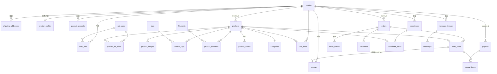

# DESIGN.md — 推し活特化型 3Dプリント受託販売プラットフォーム

> 本ドキュメントは実装担当エンジニアが**追加の意思決定なしに着手できる**ことを目的とした技術設計書である。
> 迷いやすい箇所には「決定」「理由」「代替案」を明示している。

- ドキュメントバージョン: 1.0
- 対象リポジトリ: `oshikatsu-3dprint`
- 想定読者: フロントエンド／バックエンド実装者（Next.js + Supabase 経験者）

---

## 目次

1. [サービスモデルとドメイン定義](#1-サービスモデルとドメイン定義)
2. [システム構成・技術スタック選定](#2-システム構成技術スタック選定)
3. [ディレクトリ構成](#3-ディレクトリ構成)
4. [データベース設計](#4-データベース設計)
5. [ストレージ設計](#5-ストレージ設計)
6. [API / Server Actions 設計](#6-api--server-actions-設計)
7. [決済（Stripe）設計](#7-決済stripe設計)
8. [セキュリティ & RLS 設計](#8-セキュリティ--rls-設計)
9. [UI / コンポーネント構成](#9-ui--コンポーネント構成)
10. [環境変数・外部サービス設定](#10-環境変数外部サービス設定)
11. [実装フェーズ計画](#11-実装フェーズ計画)
12. [未決定事項・将来課題](#12-未決定事項将来課題)

---

## 1. サービスモデルとドメイン定義

### 1.1 商流（重要 — ここを誤ると設計全体がずれる）

```
クリエイター ──(STL + 推奨フィラメント指定を登録)──▶ プラットフォーム
                                                        │
購入者 ──(作品を購入・決済)────────────────────────────▶ │ 運営が「販売者」
                                                        │
                                          運営が受注生産（3Dプリント）
                                                        │
                                          運営が梱包・発送 ──▶ 購入者
                                                        │
                                          売上の一部をロイヤリティとして
                                          クリエイターへ振込（payouts）
```

**決定：運営が「販売事業者（Merchant of Record）」となる。**

- 理由: 実際に印刷・梱包・発送するのは運営であり、特定商取引法上の販売主体も運営。クリエイターは「デザイン提供者」であり、ロイヤリティ収入を得る立場。
- 帰結:
  - Stripe の決済受領先は**運営アカウント1本**（Stripe Connect の Destination Charge は Phase 1 では使わない）。
  - クリエイターへの支払いは `payouts` テーブルで管理する**締め払い（月次）モデル**。
  - 在庫概念は無い（受注生産）。ただし「同時受注上限」は持てるようにする。

### 1.2 ロール定義

| ロール | 値 | 権限概要 |
|---|---|---|
| 購入者 | `buyer` | 作品閲覧・検索、マイぬい登録、カート/購入、レビュー投稿、コーデ投稿、クリエイターへの質問 |
| クリエイター | `creator` | buyer の全権限 + 作品投稿(STL添付)、自作品の編集、売上確認、取引メッセージ返信 |
| 運営管理者 | `admin` | 全注文の閲覧、STL/フィラメント指定の取得（署名付きDL）、印刷・発送ステータス管理、追跡番号入力、払込処理、通報対応 |

**決定：ロールは単一値ではなく「ベースロール + creator フラグ」で持つ。**

```
profiles.role: 'user' | 'admin'      -- システム権限
profiles.is_creator: boolean         -- クリエイター申請が承認済みか
```

- 理由: 「購入者でもありクリエイターでもある」が常態のため、排他的 enum にすると全画面で分岐が破綻する。
- JWT には `app_metadata.role` を同期し、RLS から `auth.jwt() -> 'app_metadata' ->> 'role'` で参照する（後述 8.2）。

### 1.3 中核ドメイン用語

| 用語 | 説明 | 対応テーブル |
|---|---|---|
| マイぬい | 購入者が所有するぬいぐるみ。サイズ（10cm/15cm/20cm…）を登録し、対応作品を絞り込む | `user_nuis`, `nui_sizes` |
| 作品 (Product) | クリエイターが登録した3Dプリント商品。STL 1つ以上 + 対応ぬいサイズ + 選択可能フィラメント | `products` |
| フィラメント | 出力素材（PLA白、PLAピンク、シルクゴールド等）。クリエイターが選択肢を絞り、購入者が最終選択 | `filaments`, `product_filaments` |
| 世界観タグ | 「量産型」「地雷系」「ゴシック」等の検索軸 | `tags`, `product_tags` |
| コーデ / 推し空間 | 購入者が撮影した写真に、使用した作品を紐付けて公開する投稿 | `coordinates`, `coordinate_items` |
| 制作指示 | 注文明細から運営が読む「どのSTLをどのフィラメントで何個出すか」 | `order_items` のスナップショット列 |

---

## 2. システム構成・技術スタック選定

### 2.1 構成図

```
┌──────────────────────────────────────────────────────────────┐
│ Vercel                                                        │
│  ┌────────────────────────────────────────────────────────┐  │
│  │ Next.js 15 (App Router) / TypeScript                     │  │
│  │  - RSC: 一覧・詳細の読み取り（anon key + RLS）            │  │
│  │  - Server Actions: 変更系（作品投稿/レビュー/カート等）   │  │
│  │  - Route Handlers: Stripe Webhook, STL署名URL発行, cron  │  │
│  └────────────────────────────────────────────────────────┘  │
└───────────┬──────────────────────────────┬───────────────────┘
            │                              │
            ▼                              ▼
┌───────────────────────────┐   ┌──────────────────────────────┐
│ Supabase                  │   │ Stripe                        │
│  - Auth (email + OAuth)   │   │  - Checkout Session           │
│  - PostgreSQL 15 + RLS    │   │  - Webhook (payment_intent)   │
│  - Storage (4 buckets)    │   │  - Refund                     │
│  - Edge Function (画像変換)│   └──────────────────────────────┘
└───────────────────────────┘
            │
            ▼
┌───────────────────────────┐
│ Resend (取引メール)        │
└───────────────────────────┘
```

### 2.2 技術スタック（決定表）

| レイヤ | 採用 | バージョン方針 | 理由 / 代替案 |
|---|---|---|---|
| フレームワーク | **Next.js (App Router)** | 15.x | RSC で商品一覧の初期表示を高速化。Server Actions で API 層の記述量を削減 |
| 言語 | **TypeScript** | 5.x, `strict: true` | — |
| CSS | **Tailwind CSS** | v4 | — |
| UIプリミティブ | **shadcn/ui**（Radix ベース、ソースを自リポジトリに取り込む） | — | **代替案: MUI**。却下理由=「推し活」向けの世界観を作るには DOM/クラスを自由に触れることが必須。shadcn は npm 依存でなくコード生成なので改変が容易 |
| DB / 認証 / ストレージ | **Supabase** | — | **代替案: Prisma + 自前PostgreSQL + Auth.js**。却下理由=本要件の核心である「STLをAdminのみDL可」がストレージRLSで宣言的に書ける点。自前構成だと署名URL発行を全経路で自作する必要があり、漏れが事故に直結する |
| DBアクセス | **supabase-js**（型は `supabase gen types` で生成） | — | ORM は入れない。RLS を効かせるにはユーザーJWT付きクライアントが必要で、Prisma だと RLS を活かしづらい |
| マイグレーション | **Supabase CLI**（`supabase/migrations/*.sql`） | — | SQL を正とする。ER 変更は必ず migration ファイル経由 |
| バリデーション | **Zod** | 3.x | Server Action の入力は必ず Zod スキーマを通す |
| フォーム | **React Hook Form** + `@hookform/resolvers/zod` | — | — |
| 決済 | **Stripe Checkout**（`stripe` / `@stripe/stripe-js`） | — | 3Dセキュア・コンビニ決済への拡張が容易。**代替案: Payment Element** — Phase 2 でカート内決済UXを詰める段階で移行検討 |
| 状態管理 | Server 状態は RSC + `revalidatePath`、クライアント一時状態は `useState` / `nuqs`（URLクエリ） | — | Redux/Zustand は導入しない |
| 画像 | `next/image` + Supabase Storage の画像変換 | — | — |
| メール | **Resend** + React Email | — | — |
| テスト | Vitest（ユニット）/ Playwright（E2E: 購入〜発送の主要導線） | — | — |
| Lint/Format | ESLint (next/core-web-vitals) + Prettier | — | — |

### 2.3 Supabase クライアントの使い分け（**必読・事故防止**）

3種類のクライアントを用途で厳密に分ける。ファイルは `src/lib/supabase/` 配下。

| ファイル | 使用キー | 用途 | RLS |
|---|---|---|---|
| `client.ts` | `NEXT_PUBLIC_SUPABASE_ANON_KEY` | Client Component | 効く |
| `server.ts` | anon key + cookie のユーザーセッション | RSC / Server Action / Route Handler の**通常処理** | 効く |
| `admin.ts` | `SUPABASE_SERVICE_ROLE_KEY` | Stripe Webhook、バッチ、管理集計など**ユーザー文脈が無い処理のみ** | **効かない** |

```ts
// src/lib/supabase/admin.ts
import "server-only"; // ← クライアントバンドルへの混入を型レベルで防ぐ
import { createClient } from "@supabase/supabase-js";
import type { Database } from "@/types/database.types";

/**
 * service_role は RLS を貫通する。呼び出し側で必ず権限判定を済ませてから使うこと。
 * 「ユーザーの入力値をそのまま where 条件に使う」ような使い方は禁止。
 */
export const createAdminClient = () =>
  createClient<Database>(
    process.env.NEXT_PUBLIC_SUPABASE_URL!,
    process.env.SUPABASE_SERVICE_ROLE_KEY!,
    { auth: { persistSession: false, autoRefreshToken: false } }
  );
```

---

## 3. ディレクトリ構成

```
oshikatsu-3dprint/
├─ src/
│  ├─ app/
│  │  ├─ (marketing)/                 # 未ログインでも見せるLP・利用規約
│  │  │  ├─ page.tsx
│  │  │  └─ terms/page.tsx
│  │  ├─ (shop)/                      # 購入者導線
│  │  │  ├─ products/
│  │  │  │  ├─ page.tsx               # 一覧（検索・絞込）
│  │  │  │  └─ [slug]/page.tsx        # 詳細
│  │  │  ├─ coordinates/
│  │  │  │  ├─ page.tsx
│  │  │  │  └─ [id]/page.tsx
│  │  │  ├─ cart/page.tsx
│  │  │  ├─ checkout/
│  │  │  │  ├─ page.tsx
│  │  │  │  └─ complete/page.tsx      # Stripe success_url
│  │  │  └─ creators/[handle]/page.tsx
│  │  ├─ (account)/                   # 要ログイン（購入者マイページ）
│  │  │  ├─ layout.tsx                # 認証ガード
│  │  │  ├─ mypage/page.tsx
│  │  │  ├─ mypage/nuis/page.tsx      # マイぬい登録
│  │  │  ├─ mypage/addresses/page.tsx
│  │  │  ├─ mypage/orders/page.tsx
│  │  │  ├─ mypage/orders/[id]/page.tsx
│  │  │  └─ mypage/messages/page.tsx
│  │  ├─ (creator)/                   # 要 is_creator
│  │  │  ├─ layout.tsx                # クリエイターガード
│  │  │  └─ studio/
│  │  │     ├─ page.tsx               # ダッシュボード
│  │  │     ├─ products/page.tsx
│  │  │     ├─ products/new/page.tsx
│  │  │     ├─ products/[id]/edit/page.tsx
│  │  │     ├─ sales/page.tsx         # 売上・payouts
│  │  │     └─ messages/page.tsx
│  │  ├─ (admin)/                     # 要 role='admin'
│  │  │  ├─ layout.tsx                # 管理者ガード
│  │  │  └─ admin/
│  │  │     ├─ orders/page.tsx        # 注文一覧（印刷キュー）
│  │  │     ├─ orders/[id]/page.tsx   # 制作指示・STL DL・ステータス更新
│  │  │     ├─ products/page.tsx      # 作品審査
│  │  │     ├─ payouts/page.tsx
│  │  │     └─ users/page.tsx
│  │  ├─ api/
│  │  │  ├─ stripe/webhook/route.ts
│  │  │  ├─ admin/stl/[assetId]/route.ts   # 署名付きDL URL 発行
│  │  │  └─ cron/close-payouts/route.ts
│  │  ├─ auth/callback/route.ts
│  │  ├─ layout.tsx
│  │  └─ globals.css
│  ├─ components/
│  │  ├─ ui/                          # shadcn/ui 生成物（直接編集可）
│  │  ├─ product/                     # ProductCard, FilamentPicker, NuiSizeBadge…
│  │  ├─ order/                       # OrderStatusStepper, ShippingForm…
│  │  ├─ coordinate/
│  │  └─ layout/                      # Header, Footer, RoleNav
│  ├─ features/                       # ドメインごとの Server Action + クエリ
│  │  ├─ products/{actions.ts,queries.ts,schema.ts}
│  │  ├─ orders/{actions.ts,queries.ts,schema.ts}
│  │  ├─ cart/…
│  │  ├─ coordinates/…
│  │  ├─ reviews/…
│  │  ├─ messages/…
│  │  ├─ payouts/…
│  │  └─ admin/…
│  ├─ lib/
│  │  ├─ supabase/{client.ts,server.ts,admin.ts,middleware.ts}
│  │  ├─ stripe/{server.ts,client.ts}
│  │  ├─ auth/{guards.ts,session.ts}
│  │  ├─ mail/
│  │  └─ utils.ts
│  ├─ types/database.types.ts         # supabase gen types 出力（手編集禁止）
│  └─ middleware.ts                   # セッションリフレッシュ + ルート保護
├─ supabase/
│  ├─ migrations/                     # 0001_init.sql, 0002_rls.sql …
│  ├─ seed.sql                        # nui_sizes, filaments, categories, tags
│  └─ config.toml
├─ .env.local.example
└─ DESIGN.md
```

**規約：**
- `features/*/queries.ts` = 読み取り（RSC から呼ぶ）、`features/*/actions.ts` = 変更（`"use server"`）。
- Server Action は必ず `1) 認証確認 → 2) Zod パース → 3) 権限確認 → 4) DB → 5) revalidate` の順で書く。
- コンポーネントはデフォルト Server Component。`"use client"` は入力・モーダル・3Dプレビューなど最小葉ノードにのみ付ける。

---

## 4. データベース設計

### 4.1 ER 図



### 4.2 共通方針

| 項目 | 決定 |
|---|---|
| 主キー | `uuid` + `gen_random_uuid()`（`pgcrypto`）。URL露出でIDが推測できないため |
| 金額 | `integer`（**日本円・税込・最小単位**）。`numeric` は使わない（丸め事故回避） |
| 日時 | `timestamptz`、`default now()`。アプリ表示は JST に変換 |
| 削除 | 原則**論理削除**（`deleted_at timestamptz`）。注文実績に紐づくため物理削除しない |
| 命名 | テーブル=複数形スネークケース、FK=`<単数形>_id` |
| 更新日時 | 全テーブル共通トリガ `set_updated_at()` |
| Enum | Postgres `create type` を使用（型生成に載るため） |

```sql
-- supabase/migrations/0001_init.sql（抜粋・冒頭）
create extension if not exists "pgcrypto";
create extension if not exists "pg_trgm";   -- 作品名の部分一致検索用

create or replace function public.set_updated_at()
returns trigger language plpgsql as $$
begin
  new.updated_at = now();
  return new;
end $$;
```

### 4.3 Enum 定義

```sql
create type user_role        as enum ('user', 'admin');
create type creator_status   as enum ('pending', 'approved', 'suspended');
create type product_status   as enum ('draft', 'in_review', 'published', 'rejected', 'archived');
create type order_status     as enum ('pending_payment', 'paid', 'printing', 'shipped', 'completed', 'cancelled', 'refunded');
create type item_status      as enum ('pending', 'printing', 'printed', 'shipped', 'cancelled');
create type payout_status    as enum ('unpaid', 'scheduled', 'paid', 'failed');
create type thread_kind      as enum ('pre_purchase', 'order');
create type filament_finish  as enum ('matte', 'glossy', 'silk', 'glitter', 'transparent');
```

**注文ステータス遷移（`orders.status`）**

```
pending_payment ──(Stripe: checkout.session.completed)──▶ paid
      │                                                    │
      │                                        (Admin: 印刷開始) ▼
      │                                                  printing
      │                                                    │
      │                                    (Admin: 追跡番号入力) ▼
      ├──(期限切れ/ユーザー中止)──▶ cancelled            shipped
      │                                                    │
      └──(Admin: 返金)──────────▶ refunded    (受取確認 or 自動14日) ▼
                                                        completed
```

- 前進のみ許可。逆行は禁止（`cancelled`/`refunded` は例外的に `paid`/`printing` から遷移可）。
- 遷移は**DB関数 `advance_order_status()` に集約**し、アプリから直接 `update orders set status=...` は禁止（RLS + トリガで防御、8.4 参照）。

### 4.4 テーブル定義

#### 4.4.1 ユーザー系

```sql
-- ─────────────────────────────────────────────
-- profiles : auth.users の 1:1 拡張
-- ─────────────────────────────────────────────
create table public.profiles (
  id            uuid primary key references auth.users(id) on delete cascade,
  handle        text not null unique
                  check (handle ~ '^[a-z0-9_]{3,20}$'),   -- URL用ID
  display_name  text not null check (char_length(display_name) between 1 and 50),
  avatar_url    text,
  bio           text check (char_length(bio) <= 1000),
  role          user_role not null default 'user',
  is_creator    boolean  not null default false,
  -- 通知設定
  email_opt_in  boolean  not null default true,
  created_at    timestamptz not null default now(),
  updated_at    timestamptz not null default now(),
  deleted_at    timestamptz
);
create index on public.profiles (is_creator) where deleted_at is null;

-- auth.users 作成時に profiles を自動生成
create or replace function public.handle_new_user()
returns trigger language plpgsql security definer set search_path = public as $$
begin
  insert into public.profiles (id, handle, display_name)
  values (
    new.id,
    'u' || replace(new.id::text, '-', '')::text,  -- 初期handle（後で本人が変更）
    coalesce(new.raw_user_meta_data->>'name', 'ゲスト')
  );
  return new;
end $$;
create trigger on_auth_user_created
  after insert on auth.users
  for each row execute function public.handle_new_user();
```

```sql
-- ─────────────────────────────────────────────
-- nui_sizes : マイぬいサイズマスタ（seed で投入）
-- ─────────────────────────────────────────────
create table public.nui_sizes (
  id           smallint primary key,          -- 10, 15, 20 … （固定値・可読）
  label        text not null unique,           -- '10cm (ぬいぐるみS)'
  height_mm    integer not null,
  sort_order   smallint not null default 0,
  is_active    boolean not null default true
);
-- seed 例: (10,'10cm',100,10), (15,'15cm',150,20), (20,'20cm',200,30), (0,'その他',0,99)

-- ─────────────────────────────────────────────
-- user_nuis : 購入者が登録する「マイぬい」（複数体可）
-- ─────────────────────────────────────────────
create table public.user_nuis (
  id           uuid primary key default gen_random_uuid(),
  user_id      uuid not null references public.profiles(id) on delete cascade,
  name         text not null check (char_length(name) between 1 and 30),  -- 例: 'うちの子'
  nui_size_id  smallint not null references public.nui_sizes(id),
  -- 「その他」サイズ時の実寸（任意）
  custom_height_mm integer check (custom_height_mm between 10 and 1000),
  photo_url    text,
  note         text check (char_length(note) <= 300),
  is_primary   boolean not null default false,
  created_at   timestamptz not null default now(),
  updated_at   timestamptz not null default now()
);
create index on public.user_nuis (user_id);
-- ユーザーごとに主役ぬいは1体まで
create unique index user_nuis_one_primary
  on public.user_nuis (user_id) where is_primary;
```

```sql
-- ─────────────────────────────────────────────
-- shipping_addresses : 配送先（複数登録可）
-- ─────────────────────────────────────────────
create table public.shipping_addresses (
  id            uuid primary key default gen_random_uuid(),
  user_id       uuid not null references public.profiles(id) on delete cascade,
  recipient_name text not null,
  postal_code   text not null check (postal_code ~ '^\d{3}-?\d{4}$'),
  prefecture    text not null,
  city          text not null,
  address_line1 text not null,
  address_line2 text,
  phone         text not null check (phone ~ '^[0-9\-+]{10,15}$'),
  is_default    boolean not null default false,
  created_at    timestamptz not null default now(),
  updated_at    timestamptz not null default now(),
  deleted_at    timestamptz
);
create index on public.shipping_addresses (user_id) where deleted_at is null;
create unique index shipping_addresses_one_default
  on public.shipping_addresses (user_id) where is_default and deleted_at is null;
```

```sql
-- ─────────────────────────────────────────────
-- creator_profiles : クリエイター申請・審査情報
-- ─────────────────────────────────────────────
create table public.creator_profiles (
  user_id        uuid primary key references public.profiles(id) on delete cascade,
  status         creator_status not null default 'pending',
  legal_name     text not null,                  -- 本名（公開しない）
  legal_name_kana text not null,
  birth_date     date not null,
  intro          text check (char_length(intro) <= 2000),
  portfolio_url  text,
  -- 手数料率（運営取分）。既定 30%
  commission_rate numeric(4,3) not null default 0.300
                   check (commission_rate between 0 and 1),
  approved_at    timestamptz,
  approved_by    uuid references public.profiles(id),
  reject_reason  text,
  created_at     timestamptz not null default now(),
  updated_at     timestamptz not null default now()
);

-- ─────────────────────────────────────────────
-- payout_accounts : 振込口座（★最重要機密。RLS を最も厳しく）
-- ─────────────────────────────────────────────
create table public.payout_accounts (
  user_id         uuid primary key references public.profiles(id) on delete cascade,
  bank_name       text not null,
  bank_code       text not null check (bank_code ~ '^\d{4}$'),
  branch_name     text not null,
  branch_code     text not null check (branch_code ~ '^\d{3}$'),
  account_type    text not null check (account_type in ('ordinary','checking')),
  -- 口座番号は pgsodium/Vault で暗号化して保持（平文カラムを作らない）
  account_number_enc bytea not null,
  account_holder_kana text not null check (account_holder_kana ~ '^[ｦ-ﾟア-ンー（）\.\-　 ]+$'),
  updated_at      timestamptz not null default now()
);
comment on table public.payout_accounts is
  '本人と service_role のみアクセス可。Admin 画面にも平文表示しない（振込CSV生成時のみ復号）';
```

> **決定：口座番号は `bytea` に暗号化保存。** 復号は Edge Function / サーバー側の振込CSV生成処理のみが行い、管理画面には下4桁のマスク表示しか出さない。理由=管理者アカウント1つの漏洩で全クリエイターの口座が流出する事態を防ぐため。

#### 4.4.2 作品系

```sql
-- ─────────────────────────────────────────────
-- categories / tags / filaments : マスタ
-- ─────────────────────────────────────────────
create table public.categories (
  id          smallint generated always as identity primary key,
  slug        text not null unique,
  name        text not null,       -- '家具', '小物', 'アクセサリー', '推し空間パーツ'
  parent_id   smallint references public.categories(id),
  sort_order  smallint not null default 0,
  is_active   boolean not null default true
);

create table public.tags (
  id          integer generated always as identity primary key,
  slug        text not null unique,
  name        text not null,       -- '量産型', '地雷系', 'ゴシック', '和風', 'カフェ'
  kind        text not null default 'worldview'
                check (kind in ('worldview','event','color','other')),
  is_active   boolean not null default true
);

create table public.filaments (
  id          integer generated always as identity primary key,
  code        text not null unique,        -- 'PLA-WHT-01'
  name        text not null,               -- 'PLA ミルクホワイト'
  material    text not null,               -- 'PLA','PETG','TPU'
  color_name  text not null,
  color_hex   text not null check (color_hex ~ '^#[0-9A-Fa-f]{6}$'),
  finish      filament_finish not null default 'matte',
  -- 割増料金（円）: 特殊フィラメントは加算
  surcharge   integer not null default 0 check (surcharge >= 0),
  swatch_url  text,
  is_active   boolean not null default true,
  sort_order  smallint not null default 0
);
```

```sql
-- ─────────────────────────────────────────────
-- products : 作品
-- ─────────────────────────────────────────────
create table public.products (
  id             uuid primary key default gen_random_uuid(),
  creator_id     uuid not null references public.profiles(id) on delete restrict,
  slug           text not null unique check (slug ~ '^[a-z0-9\-]{3,60}$'),
  title          text not null check (char_length(title) between 1 and 80),
  description    text not null check (char_length(description) <= 5000),
  category_id    smallint not null references public.categories(id),
  status         product_status not null default 'draft',

  -- 価格（税込・円）
  base_price     integer not null check (base_price between 100 and 500000),

  -- 物理仕様（運営の印刷計画に使う）
  size_w_mm      integer check (size_w_mm > 0),
  size_d_mm      integer check (size_d_mm > 0),
  size_h_mm      integer check (size_h_mm > 0),
  est_weight_g   integer check (est_weight_g > 0),
  est_print_min  integer check (est_print_min > 0),   -- 想定出力時間（分）
  -- 出力の注意事項（サポート要否・積層ピッチなど、Admin のみ閲覧）
  print_note     text check (char_length(print_note) <= 2000),

  -- 同時進行の受注上限（NULL=無制限）
  max_concurrent_orders integer check (max_concurrent_orders > 0),

  -- 集計キャッシュ（トリガで更新）
  review_count   integer not null default 0,
  review_avg     numeric(3,2) not null default 0,
  sold_count     integer not null default 0,
  favorite_count integer not null default 0,

  published_at   timestamptz,
  rejected_reason text,
  created_at     timestamptz not null default now(),
  updated_at     timestamptz not null default now(),
  deleted_at     timestamptz,

  -- 公開するなら必ず公開日時を持つ
  constraint products_published_consistency
    check (status <> 'published' or published_at is not null)
);
create index on public.products (status, published_at desc) where deleted_at is null;
create index on public.products (creator_id) where deleted_at is null;
create index on public.products (category_id) where deleted_at is null;
create index products_title_trgm on public.products using gin (title gin_trgm_ops);
```

```sql
-- ─────────────────────────────────────────────
-- product_assets : STL 等の制作データ（★非公開）
-- ─────────────────────────────────────────────
create table public.product_assets (
  id            uuid primary key default gen_random_uuid(),
  product_id    uuid not null references public.products(id) on delete cascade,
  -- Storage の private バケット内パス: '<creator_id>/<product_id>/<uuid>.stl'
  storage_path  text not null unique,
  original_name text not null,
  file_ext      text not null check (file_ext in ('stl','3mf','obj','step')),
  file_size     bigint not null check (file_size between 1 and 209715200), -- 200MB
  checksum_sha256 text,
  -- 1作品に複数パーツがある場合の識別
  part_label    text,                                   -- '本体', '台座'
  quantity_per_item smallint not null default 1 check (quantity_per_item > 0),
  sort_order    smallint not null default 0,
  created_at    timestamptz not null default now()
);
create index on public.product_assets (product_id);
comment on table public.product_assets is
  'STL 実体は private バケット。参照権は creator(自分の作品のみ) と admin のみ。buyer は一切参照不可';
```

```sql
-- ─────────────────────────────────────────────
-- product_images : 公開画像
-- ─────────────────────────────────────────────
create table public.product_images (
  id          uuid primary key default gen_random_uuid(),
  product_id  uuid not null references public.products(id) on delete cascade,
  image_url   text not null,
  alt         text,
  sort_order  smallint not null default 0,
  created_at  timestamptz not null default now()
);
create index on public.product_images (product_id, sort_order);

-- ─────────────────────────────────────────────
-- 中間テーブル群
-- ─────────────────────────────────────────────
create table public.product_nui_sizes (
  product_id  uuid not null references public.products(id) on delete cascade,
  nui_size_id smallint not null references public.nui_sizes(id),
  primary key (product_id, nui_size_id)
);
create index on public.product_nui_sizes (nui_size_id);

create table public.product_tags (
  product_id uuid not null references public.products(id) on delete cascade,
  tag_id     integer not null references public.tags(id) on delete cascade,
  primary key (product_id, tag_id)
);
create index on public.product_tags (tag_id);

-- 購入者が選べるフィラメントの選択肢（クリエイターが限定）
create table public.product_filaments (
  product_id  uuid not null references public.products(id) on delete cascade,
  filament_id integer not null references public.filaments(id),
  is_default  boolean not null default false,
  primary key (product_id, filament_id)
);
create unique index product_filaments_one_default
  on public.product_filaments (product_id) where is_default;

-- お気に入り
create table public.favorites (
  user_id    uuid not null references public.profiles(id) on delete cascade,
  product_id uuid not null references public.products(id) on delete cascade,
  created_at timestamptz not null default now(),
  primary key (user_id, product_id)
);
```

#### 4.4.3 カート・注文系

```sql
-- ─────────────────────────────────────────────
-- cart_items : ログインユーザーのカート（DB永続）
-- ─────────────────────────────────────────────
create table public.cart_items (
  id          uuid primary key default gen_random_uuid(),
  user_id     uuid not null references public.profiles(id) on delete cascade,
  product_id  uuid not null references public.products(id) on delete cascade,
  filament_id integer not null references public.filaments(id),
  nui_size_id smallint references public.nui_sizes(id),   -- 対応サイズが複数ある作品用
  quantity    smallint not null default 1 check (quantity between 1 and 20),
  created_at  timestamptz not null default now(),
  updated_at  timestamptz not null default now(),
  -- 同一構成は数量にまとめる
  unique (user_id, product_id, filament_id, nui_size_id)
);
create index on public.cart_items (user_id);
```

```sql
-- ─────────────────────────────────────────────
-- orders : 注文ヘッダ
-- ─────────────────────────────────────────────
create table public.orders (
  id                uuid primary key default gen_random_uuid(),
  order_number      text not null unique,        -- 'OS-20260903-0001'（トリガ採番）
  buyer_id          uuid not null references public.profiles(id) on delete restrict,
  status            order_status not null default 'pending_payment',

  -- 金額（すべて税込・円）
  subtotal          integer not null check (subtotal >= 0),
  shipping_fee      integer not null default 0 check (shipping_fee >= 0),
  discount          integer not null default 0 check (discount >= 0),
  total             integer not null check (total >= 0),

  -- 配送先スナップショット（住所は後から編集されうるため注文時点を固定）
  ship_recipient_name text not null,
  ship_postal_code    text not null,
  ship_prefecture     text not null,
  ship_city           text not null,
  ship_address_line1  text not null,
  ship_address_line2  text,
  ship_phone          text not null,

  buyer_note        text check (char_length(buyer_note) <= 1000),
  admin_note        text,                         -- Admin のみ閲覧

  -- Stripe
  stripe_checkout_session_id text unique,
  stripe_payment_intent_id   text unique,

  paid_at           timestamptz,
  printing_at       timestamptz,
  shipped_at        timestamptz,
  completed_at      timestamptz,
  cancelled_at      timestamptz,
  refunded_at       timestamptz,
  created_at        timestamptz not null default now(),
  updated_at        timestamptz not null default now(),

  constraint orders_total_matches
    check (total = subtotal + shipping_fee - discount),
  constraint orders_paid_has_timestamp
    check (status not in ('paid','printing','shipped','completed') or paid_at is not null)
);
create index on public.orders (buyer_id, created_at desc);
create index on public.orders (status, paid_at) where status in ('paid','printing');
```

```sql
-- ─────────────────────────────────────────────
-- order_items : 注文明細 =「制作指示書」
--   ★ products/filaments が後から変更されても注文内容が壊れないよう
--     表示・金額・仕様をすべてスナップショットする
-- ─────────────────────────────────────────────
create table public.order_items (
  id              uuid primary key default gen_random_uuid(),
  order_id        uuid not null references public.orders(id) on delete cascade,
  product_id      uuid not null references public.products(id) on delete restrict,
  creator_id      uuid not null references public.profiles(id) on delete restrict,

  -- スナップショット
  product_title   text not null,
  product_image_url text,
  filament_id     integer not null references public.filaments(id),
  filament_name   text not null,
  filament_color_hex text not null,
  nui_size_id     smallint references public.nui_sizes(id),
  nui_size_label  text,

  unit_price      integer not null check (unit_price >= 0),   -- 割増込みの単価
  quantity        smallint not null check (quantity between 1 and 20),
  line_total      integer not null check (line_total >= 0),

  -- 精算計算用（注文時点の手数料率を固定）
  commission_rate numeric(4,3) not null,
  creator_revenue integer not null check (creator_revenue >= 0),

  -- 明細ごとの製造ステータス（複数クリエイター混在注文に対応）
  item_status     item_status not null default 'pending',
  printed_at      timestamptz,

  created_at      timestamptz not null default now(),
  updated_at      timestamptz not null default now(),

  constraint order_items_line_total_matches
    check (line_total = unit_price * quantity)
);
create index on public.order_items (order_id);
create index on public.order_items (creator_id, created_at desc);
create index on public.order_items (product_id);
```

> **制作指示の取得方法：** Admin 画面は `order_items` → `product_assets`（`product_id` 経由）で STL 一覧を引き、`filament_name` / `filament_color_hex` / `quantity` / `products.print_note` を印刷指示として表示する。STL は current 版を参照する設計（注文時点のSTLを凍結したい場合は 12.2 参照）。

```sql
-- ─────────────────────────────────────────────
-- order_events : ステータス変更の監査ログ
-- ─────────────────────────────────────────────
create table public.order_events (
  id          bigint generated always as identity primary key,
  order_id    uuid not null references public.orders(id) on delete cascade,
  from_status order_status,
  to_status   order_status not null,
  actor_id    uuid references public.profiles(id),  -- NULL = system(webhook/cron)
  reason      text,
  created_at  timestamptz not null default now()
);
create index on public.order_events (order_id, created_at);

-- ─────────────────────────────────────────────
-- shipments : 発送情報（分割発送に備え1:N）
-- ─────────────────────────────────────────────
create table public.shipments (
  id            uuid primary key default gen_random_uuid(),
  order_id      uuid not null references public.orders(id) on delete cascade,
  carrier       text not null check (carrier in ('yamato','sagawa','japanpost','other')),
  tracking_number text not null,
  tracking_url  text,
  shipped_at    timestamptz not null default now(),
  created_by    uuid not null references public.profiles(id),
  created_at    timestamptz not null default now(),
  unique (carrier, tracking_number)
);
create index on public.shipments (order_id);
```

**採番トリガ（`order_number`）**

```sql
create sequence public.order_number_seq;

create or replace function public.set_order_number()
returns trigger language plpgsql as $$
begin
  if new.order_number is null then
    new.order_number := 'OS-'
      || to_char(now() at time zone 'Asia/Tokyo', 'YYYYMMDD')
      || '-' || lpad(nextval('public.order_number_seq')::text, 5, '0');
  end if;
  return new;
end $$;
create trigger orders_set_number
  before insert on public.orders
  for each row execute function public.set_order_number();
```

#### 4.4.4 コーデ・推し空間

```sql
-- ─────────────────────────────────────────────
-- coordinates : 推し空間 / コーデ写真投稿
-- ─────────────────────────────────────────────
create table public.coordinates (
  id           uuid primary key default gen_random_uuid(),
  user_id      uuid not null references public.profiles(id) on delete cascade,
  title        text not null check (char_length(title) between 1 and 60),
  body         text check (char_length(body) <= 2000),
  cover_image_url text not null,
  user_nui_id  uuid references public.user_nuis(id) on delete set null,
  nui_size_id  smallint references public.nui_sizes(id),
  is_public    boolean not null default true,
  like_count   integer not null default 0,
  created_at   timestamptz not null default now(),
  updated_at   timestamptz not null default now(),
  deleted_at   timestamptz
);
create index on public.coordinates (is_public, created_at desc) where deleted_at is null;
create index on public.coordinates (user_id) where deleted_at is null;

create table public.coordinate_images (
  id            uuid primary key default gen_random_uuid(),
  coordinate_id uuid not null references public.coordinates(id) on delete cascade,
  image_url     text not null,
  sort_order    smallint not null default 0
);

-- ─────────────────────────────────────────────
-- coordinate_items : 使用作品の紐付け（写真上の座標も持てる）
-- ─────────────────────────────────────────────
create table public.coordinate_items (
  id            uuid primary key default gen_random_uuid(),
  coordinate_id uuid not null references public.coordinates(id) on delete cascade,
  product_id    uuid not null references public.products(id) on delete cascade,
  -- タグピンの位置（カバー画像に対する 0.0–1.0 の相対座標）
  pin_x         numeric(4,3) check (pin_x between 0 and 1),
  pin_y         numeric(4,3) check (pin_y between 0 and 1),
  note          text check (char_length(note) <= 200),
  sort_order    smallint not null default 0,
  unique (coordinate_id, product_id)
);
create index on public.coordinate_items (product_id);

create table public.coordinate_likes (
  coordinate_id uuid not null references public.coordinates(id) on delete cascade,
  user_id       uuid not null references public.profiles(id) on delete cascade,
  created_at    timestamptz not null default now(),
  primary key (coordinate_id, user_id)
);
```

#### 4.4.5 レビュー

```sql
create table public.reviews (
  id            uuid primary key default gen_random_uuid(),
  product_id    uuid not null references public.products(id) on delete cascade,
  user_id       uuid not null references public.profiles(id) on delete cascade,
  -- 購入者レビューのみ許可するため明細に紐付ける
  order_item_id uuid not null unique references public.order_items(id) on delete cascade,
  rating        smallint not null check (rating between 1 and 5),
  title         text check (char_length(title) <= 60),
  body          text check (char_length(body) <= 2000),
  is_public     boolean not null default true,
  -- クリエイターからの返信
  creator_reply text check (char_length(creator_reply) <= 1000),
  creator_replied_at timestamptz,
  created_at    timestamptz not null default now(),
  updated_at    timestamptz not null default now(),
  deleted_at    timestamptz
);
create index on public.reviews (product_id, created_at desc) where deleted_at is null;
create index on public.reviews (user_id);

-- 使用例写真
create table public.review_images (
  id          uuid primary key default gen_random_uuid(),
  review_id   uuid not null references public.reviews(id) on delete cascade,
  image_url   text not null,
  sort_order  smallint not null default 0
);
```

**レビュー集計トリガ**

```sql
create or replace function public.refresh_product_review_stats()
returns trigger language plpgsql security definer set search_path = public as $$
declare pid uuid;
begin
  pid := coalesce(new.product_id, old.product_id);
  update public.products p set
    review_count = s.cnt,
    review_avg   = coalesce(s.avg, 0)
  from (
    select count(*) cnt, avg(rating)::numeric(3,2) avg
    from public.reviews
    where product_id = pid and deleted_at is null and is_public
  ) s
  where p.id = pid;
  return null;
end $$;

create trigger reviews_stats
  after insert or update or delete on public.reviews
  for each row execute function public.refresh_product_review_stats();
```

#### 4.4.6 メッセージ

```sql
-- ─────────────────────────────────────────────
-- message_threads : 1スレッド = (購入者, クリエイター) [+ 注文]
-- ─────────────────────────────────────────────
create table public.message_threads (
  id          uuid primary key default gen_random_uuid(),
  kind        thread_kind not null,
  buyer_id    uuid not null references public.profiles(id) on delete cascade,
  creator_id  uuid not null references public.profiles(id) on delete cascade,
  product_id  uuid references public.products(id) on delete set null,
  order_id    uuid references public.orders(id) on delete set null,
  subject     text check (char_length(subject) <= 100),
  last_message_at timestamptz not null default now(),
  buyer_unread_count   integer not null default 0,
  creator_unread_count integer not null default 0,
  is_closed   boolean not null default false,
  created_at  timestamptz not null default now(),

  constraint threads_order_required_for_order_kind
    check (kind <> 'order' or order_id is not null),
  constraint threads_no_self_message
    check (buyer_id <> creator_id)
);
create index on public.message_threads (buyer_id, last_message_at desc);
create index on public.message_threads (creator_id, last_message_at desc);
-- 注文スレッドは注文ごとに1本
create unique index message_threads_unique_order
  on public.message_threads (order_id) where order_id is not null;

create table public.messages (
  id          uuid primary key default gen_random_uuid(),
  thread_id   uuid not null references public.message_threads(id) on delete cascade,
  sender_id   uuid not null references public.profiles(id) on delete cascade,
  body        text not null check (char_length(body) between 1 and 2000),
  attachment_url text,
  -- Admin が介入した場合のフラグ（カスタマーサポート）
  is_admin_note boolean not null default false,
  read_at     timestamptz,
  created_at  timestamptz not null default now(),
  deleted_at  timestamptz
);
create index on public.messages (thread_id, created_at);
```

#### 4.4.7 精算（payouts）

```sql
-- ─────────────────────────────────────────────
-- payouts : クリエイターへの月次振込サマリ
-- ─────────────────────────────────────────────
create table public.payouts (
  id             uuid primary key default gen_random_uuid(),
  creator_id     uuid not null references public.profiles(id) on delete restrict,
  -- 対象期間（月次締め）
  period_start   date not null,
  period_end     date not null,
  gross_amount   integer not null check (gross_amount >= 0),  -- 売上合計
  commission     integer not null check (commission >= 0),    -- 運営手数料
  transfer_fee   integer not null default 0 check (transfer_fee >= 0), -- 振込手数料
  net_amount     integer not null check (net_amount >= 0),    -- 実振込額
  status         payout_status not null default 'unpaid',
  scheduled_date date,
  paid_at        timestamptz,
  paid_by        uuid references public.profiles(id),
  transaction_ref text,                                      -- 銀行側の参照番号
  note           text,
  created_at     timestamptz not null default now(),
  updated_at     timestamptz not null default now(),

  unique (creator_id, period_start, period_end),
  constraint payouts_net_matches
    check (net_amount = gross_amount - commission - transfer_fee),
  constraint payouts_period_order check (period_start <= period_end)
);
create index on public.payouts (creator_id, period_start desc);
create index on public.payouts (status, scheduled_date);

-- ─────────────────────────────────────────────
-- payout_items : 明細（どの order_item が含まれるか）
-- ─────────────────────────────────────────────
create table public.payout_items (
  id            uuid primary key default gen_random_uuid(),
  payout_id     uuid not null references public.payouts(id) on delete cascade,
  order_item_id uuid not null unique references public.order_items(id) on delete restrict,
  amount        integer not null check (amount >= 0),   -- creator_revenue のコピー
  created_at    timestamptz not null default now()
);
create index on public.payout_items (payout_id);
```

> **`order_item_id` に UNIQUE を張っている点が肝。** 同じ明細が二重に払い出されることを DB レベルで防ぐ。

**精算対象の判定ルール（確定）**

- 対象: `orders.status = 'completed'` かつ `completed_at` が対象月内、`order_items.item_status <> 'cancelled'`。
- 締め: 毎月1日 03:00 JST に前月分を集計して `payouts` を `unpaid` で生成（cron）。
- 支払: `net_amount < 3,000` の場合は繰越（`payouts` を作らず翌月に合算）。

---

## 5. ストレージ設計

### 5.1 バケット構成

| バケット | 公開設定 | 用途 | パス規約 | 上限 |
|---|---|---|---|---|
| `product-images` | **public** | 作品の商品画像 | `{creator_id}/{product_id}/{uuid}.webp` | 5MB / image/* |
| `product-assets` | **private** ★ | **STL / 3MF などの制作データ** | `{creator_id}/{product_id}/{uuid}.stl` | 200MB |
| `user-content` | public | アバター、マイぬい写真、コーデ写真、レビュー写真 | `{user_id}/{kind}/{uuid}.webp` | 5MB / image/* |
| `message-attachments` | private | 取引メッセージ添付 | `{thread_id}/{uuid}.{ext}` | 10MB |

```sql
insert into storage.buckets (id, name, public, file_size_limit, allowed_mime_types) values
  ('product-images',      'product-images',      true,   5242880,  array['image/jpeg','image/png','image/webp']),
  ('product-assets',      'product-assets',      false,  209715200,array['model/stl','application/sla','application/octet-stream','model/3mf']),
  ('user-content',        'user-content',        true,   5242880,  array['image/jpeg','image/png','image/webp']),
  ('message-attachments', 'message-attachments', false,  10485760, null);
```

### 5.2 STL の保護方針（本要件の核心）

```
【禁止】 STL の公開URLをDBに保存する / クライアントに渡す
【必須】 DB には storage_path（バケット内相対パス）のみ保存する
【必須】 ダウンロードは毎回サーバー側で「権限判定 → 署名付きURL(有効期限60秒)」を発行
```

**アクセスマトリクス（`product-assets`）**

| 主体 | 一覧(SELECT) | DL | アップロード | 削除 |
|---|---|---|---|---|
| 未ログイン | ✗ | ✗ | ✗ | ✗ |
| 購入者（購入済みでも） | ✗ | ✗ | ✗ | ✗ |
| クリエイター（自分の作品） | ✓ | ✓ | ✓ | ✓（未販売時のみ） |
| クリエイター（他人の作品） | ✗ | ✗ | ✗ | ✗ |
| Admin | ✓ | ✓ | ✓ | ✓ |

> **「購入者は購入してもSTLを取得できない」** ことを明記。本サービスはデータ販売ではなく完成品販売である。

**署名付きURL発行 Route Handler**

```ts
// src/app/api/admin/stl/[assetId]/route.ts
import { NextRequest, NextResponse } from "next/server";
import { createClient } from "@/lib/supabase/server";
import { createAdminClient } from "@/lib/supabase/admin";

export async function GET(
  _req: NextRequest,
  { params }: { params: Promise<{ assetId: string }> }
) {
  const { assetId } = await params;
  const supabase = await createClient();

  // 1) 認証
  const { data: { user } } = await supabase.auth.getUser();
  if (!user) return NextResponse.json({ error: "unauthorized" }, { status: 401 });

  // 2) 権限（admin、または当該作品のクリエイター本人）
  const { data: asset } = await supabase
    .from("product_assets")
    .select("storage_path, original_name, products!inner(creator_id)")
    .eq("id", assetId)
    .single(); // ← RLS が効くので、権限が無ければここで null になる

  if (!asset) return NextResponse.json({ error: "not_found" }, { status: 404 });

  // 3) 署名付きURL（60秒・ダウンロード名指定）
  const admin = createAdminClient();
  const { data, error } = await admin.storage
    .from("product-assets")
    .createSignedUrl(asset.storage_path, 60, { download: asset.original_name });

  if (error) return NextResponse.json({ error: "sign_failed" }, { status: 500 });

  // 4) 監査ログ
  await admin.from("asset_access_logs").insert({
    asset_id: assetId, user_id: user.id, action: "download",
  });

  return NextResponse.json({ url: data.signedUrl });
}
```

```sql
-- 監査ログテーブル
create table public.asset_access_logs (
  id         bigint generated always as identity primary key,
  asset_id   uuid not null references public.product_assets(id) on delete cascade,
  user_id    uuid not null references public.profiles(id),
  action     text not null check (action in ('download','view')),
  created_at timestamptz not null default now()
);
create index on public.asset_access_logs (asset_id, created_at desc);
create index on public.asset_access_logs (user_id, created_at desc);
```

---

## 6. API / Server Actions 設計

### 6.1 方針

| 種別 | 実装手段 | 理由 |
|---|---|---|
| 一覧・詳細の読み取り | **RSC 内で直接クエリ**（`features/*/queries.ts`） | 余分な HTTP ホップを作らない |
| ユーザー操作による変更 | **Server Actions**（`features/*/actions.ts`） | CSRF 保護が組込み、型が繋がる |
| 外部からの受信 | **Route Handlers**（`app/api/**`） | Stripe Webhook、cron、署名URL発行 |
| リアルタイム | Supabase Realtime（メッセージ、注文ステータス） | Phase 2 |

### 6.2 Server Action の共通テンプレート

```ts
// src/features/products/actions.ts
"use server";

import { z } from "zod";
import { revalidatePath } from "next/cache";
import { createClient } from "@/lib/supabase/server";
import { requireCreator } from "@/lib/auth/guards";

export type ActionResult<T = void> =
  | { ok: true; data: T }
  | { ok: false; error: string; fieldErrors?: Record<string, string[]> };

const createProductSchema = z.object({
  title: z.string().min(1).max(80),
  description: z.string().max(5000),
  categoryId: z.number().int().positive(),
  basePrice: z.number().int().min(100).max(500_000),
  nuiSizeIds: z.array(z.number().int()).min(1, "対応サイズを1つ以上選択してください"),
  tagIds: z.array(z.number().int()).max(10),
  filamentIds: z.array(z.number().int()).min(1),
  defaultFilamentId: z.number().int(),
  sizeWMm: z.number().int().positive().optional(),
  sizeDMm: z.number().int().positive().optional(),
  sizeHMm: z.number().int().positive().optional(),
  estWeightG: z.number().int().positive().optional(),
  printNote: z.string().max(2000).optional(),
}).refine(
  (v) => v.filamentIds.includes(v.defaultFilamentId),
  { message: "既定フィラメントは選択肢に含めてください", path: ["defaultFilamentId"] }
);

export async function createProduct(
  input: z.input<typeof createProductSchema>
): Promise<ActionResult<{ id: string }>> {
  // 1) 認証 + 権限
  const { user } = await requireCreator();          // 未承認クリエイターは throw
  // 2) バリデーション
  const parsed = createProductSchema.safeParse(input);
  if (!parsed.success) {
    return { ok: false, error: "入力エラー",
             fieldErrors: parsed.error.flatten().fieldErrors };
  }
  const v = parsed.data;

  // 3) DB（多テーブル更新は RPC でトランザクション化）
  const supabase = await createClient();
  const { data, error } = await supabase.rpc("create_product_with_relations", {
    p_creator_id: user.id,
    p_payload: v,
  });
  if (error) return { ok: false, error: "作品の作成に失敗しました" };

  // 4) キャッシュ更新
  revalidatePath("/studio/products");
  return { ok: true, data: { id: data.id } };
}
```

> **決定：複数テーブルにまたがる書き込みは Postgres 関数（RPC）にまとめる。**
> 理由=supabase-js にトランザクション API が無く、途中失敗で `products` だけ残る不整合が起きるため。

### 6.3 機能モジュール別 一覧表

凡例: 🔓公開 / 👤要ログイン / 🎨要クリエイター / 🛡️要Admin

#### A. 認証・プロフィール

| 処理 | 種別 | シグネチャ | 権限 | 備考 |
|---|---|---|---|---|
| サインアップ／ログイン | Supabase Auth UI | — | 🔓 | Email OTP + Google |
| OAuth コールバック | Route | `GET /auth/callback` | 🔓 | セッション交換 |
| プロフィール更新 | Action | `updateProfile(input)` | 👤 | handle 重複チェック |
| アバター更新 | Action | `updateAvatar(file)` | 👤 | `user-content` へ |
| クリエイター申請 | Action | `applyCreator(input)` | 👤 | `creator_profiles` を `pending` で作成 |
| 申請の承認／却下 | Action | `reviewCreatorApplication(userId, decision, reason?)` | 🛡️ | 承認時 `profiles.is_creator = true` + JWT claim 同期 |

#### B. マイぬい・配送先

| 処理 | 種別 | シグネチャ | 権限 |
|---|---|---|---|
| マイぬい一覧 | Query | `listMyNuis()` | 👤 |
| マイぬい登録／更新／削除 | Action | `upsertNui(input)` / `deleteNui(id)` | 👤 |
| 主役ぬい設定 | Action | `setPrimaryNui(id)` | 👤 |
| 配送先 CRUD | Action | `upsertAddress` / `deleteAddress` / `setDefaultAddress` | 👤 |

#### C. 作品（Products）

| 処理 | 種別 | シグネチャ | 権限 | 備考 |
|---|---|---|---|---|
| 作品検索 | Query | `searchProducts(filters)` | 🔓 | 下記フィルタ仕様参照 |
| 作品詳細 | Query | `getProductBySlug(slug)` | 🔓 | `published` のみ |
| 作品作成 | Action | `createProduct(input)` | 🎨 | RPC でトランザクション |
| 作品更新 | Action | `updateProduct(id, input)` | 🎨 | 自作品のみ（RLS で担保） |
| STL アップロード | Action | `uploadProductAsset(productId, file, meta)` | 🎨 | private バケット |
| STL 削除 | Action | `deleteProductAsset(assetId)` | 🎨 | 販売実績があれば拒否 |
| 商品画像アップロード | Action | `uploadProductImage(productId, file)` | 🎨 | |
| 審査申請 | Action | `submitForReview(productId)` | 🎨 | `draft` → `in_review`。STL 1件以上・画像1件以上が必須 |
| 審査（公開／却下） | Action | `reviewProduct(id, decision, reason?)` | 🛡️ | `in_review` → `published` / `rejected` |
| 販売停止 | Action | `archiveProduct(id)` | 🎨🛡️ | 進行中注文があっても可（新規購入のみ停止） |
| お気に入り登録／解除 | Action | `toggleFavorite(productId)` | 👤 | |

**検索フィルタ仕様（`searchProducts`）**

```ts
type ProductFilters = {
  q?: string;               // 部分一致（pg_trgm on title）
  categoryId?: number;
  tagIds?: number[];        // AND 条件
  nuiSizeIds?: number[];    // OR 条件（マイぬい登録があれば初期値に自動投入）
  filamentIds?: number[];
  priceMin?: number;
  priceMax?: number;
  creatorHandle?: string;
  sort?: "newest" | "popular" | "price_asc" | "price_desc" | "rating";
  page?: number;            // 1-based
  perPage?: number;         // default 24, max 60
};
```

> **UX 決定：** ログイン中かつマイぬい登録済みのユーザーは、`nuiSizeIds` の初期値に主役ぬいのサイズが入る（「うちの子に合う作品だけ表示」がデフォルト）。解除可能なチップ UI で示す。

#### D. カート・注文

| 処理 | 種別 | シグネチャ | 権限 | 備考 |
|---|---|---|---|---|
| カート取得 | Query | `getCart()` | 👤 | 価格は都度再計算 |
| カート追加 | Action | `addToCart(input)` | 👤 | 作品が `published` か検証 |
| 数量変更／削除 | Action | `updateCartItem` / `removeCartItem` | 👤 | |
| Checkout 開始 | Action | `startCheckout(addressId)` | 👤 | ①在庫/公開状態の再検証 ②`orders` を `pending_payment` で作成 ③Stripe Session 作成 ④URL 返却 |
| 決済完了受信 | Route | `POST /api/stripe/webhook` | system | 署名検証必須 |
| 自分の注文一覧 | Query | `listMyOrders()` | 👤 | |
| 注文詳細 | Query | `getMyOrder(id)` | 👤 | 自分の注文のみ |
| 受取確認 | Action | `confirmDelivery(orderId)` | 👤 | `shipped` → `completed` |
| キャンセル依頼 | Action | `requestCancel(orderId, reason)` | 👤 | `printing` 前のみ。以降は Admin 判断 |

#### E. Admin（受注管理）

| 処理 | 種別 | シグネチャ | 権限 | 備考 |
|---|---|---|---|---|
| 注文一覧（印刷キュー） | Query | `adminListOrders(filters)` | 🛡️ | status / 期間 / クリエイターで絞込 |
| 制作指示取得 | Query | `adminGetProductionSheet(orderId)` | 🛡️ | 明細 × STL一覧 × フィラメント × 数量 × print_note |
| STL 一括DL URL 発行 | Route | `GET /api/admin/stl/[assetId]` | 🛡️🎨 | 60秒署名URL + 監査ログ |
| 印刷開始 | Action | `startPrinting(orderId)` | 🛡️ | `paid` → `printing` |
| 明細ステータス更新 | Action | `updateItemStatus(orderItemId, status)` | 🛡️ | 全明細 `printed` で発送可能に |
| 発送登録 | Action | `registerShipment(orderId, {carrier, trackingNumber})` | 🛡️ | `printing` → `shipped`、購入者へメール |
| 追跡番号修正 | Action | `updateShipment(shipmentId, input)` | 🛡️ | |
| 注文キャンセル／返金 | Action | `cancelOrder(orderId, reason)` / `refundOrder(orderId, amount?)` | 🛡️ | Stripe Refund API 連携 |
| 管理メモ | Action | `updateAdminNote(orderId, note)` | 🛡️ | |

**制作指示ビュー（Admin 画面のデータソース）**

```sql
create or replace view public.admin_production_sheets as
select
  o.id                as order_id,
  o.order_number,
  o.status            as order_status,
  o.paid_at,
  oi.id               as order_item_id,
  oi.item_status,
  oi.product_title,
  oi.filament_name,
  oi.filament_color_hex,
  oi.nui_size_label,
  oi.quantity,
  p.print_note,
  p.est_print_min,
  p.est_weight_g,
  cp.display_name     as creator_name,
  coalesce(
    jsonb_agg(
      jsonb_build_object(
        'assetId',   pa.id,
        'partLabel', pa.part_label,
        'fileName',  pa.original_name,
        'fileSize',  pa.file_size,
        'qtyPerItem',pa.quantity_per_item
      ) order by pa.sort_order
    ) filter (where pa.id is not null), '[]'::jsonb
  ) as assets
from public.orders o
join public.order_items oi on oi.order_id = o.id
join public.products p     on p.id = oi.product_id
join public.profiles cp    on cp.id = oi.creator_id
left join public.product_assets pa on pa.product_id = p.id
group by o.id, oi.id, p.id, cp.display_name;

-- ビューは呼び出し元の権限で評価させる（Postgres 15+）
alter view public.admin_production_sheets set (security_invoker = true);
```

> `security_invoker = true` により、ビュー経由でも基表の RLS が効く。Admin 以外がこのビューを引いても自分に関係ある行しか返らない。

#### F. コーデ・推し空間

| 処理 | 種別 | シグネチャ | 権限 |
|---|---|---|---|
| 一覧（公開） | Query | `listCoordinates(filters)` | 🔓 |
| 詳細 | Query | `getCoordinate(id)` | 🔓 |
| 投稿／更新／削除 | Action | `upsertCoordinate` / `deleteCoordinate` | 👤（自分のみ） |
| 使用作品タグ付け | Action | `setCoordinateItems(coordinateId, items)` | 👤 |
| いいね | Action | `toggleCoordinateLike(id)` | 👤 |
| 作品詳細の「この作品を使ったコーデ」 | Query | `listCoordinatesByProduct(productId)` | 🔓 |

#### G. レビュー

| 処理 | 種別 | シグネチャ | 権限 | 備考 |
|---|---|---|---|---|
| 投稿 | Action | `createReview(orderItemId, input)` | 👤 | **`orders.status = 'completed'` かつ自分の明細のみ**。1明細1件 |
| 更新／削除 | Action | `updateReview` / `deleteReview` | 👤 | 投稿から14日以内のみ編集可 |
| クリエイター返信 | Action | `replyToReview(reviewId, body)` | 🎨 | 自作品のレビューのみ |
| 非公開化 | Action | `hideReview(reviewId, reason)` | 🛡️ | 規約違反時 |

#### H. メッセージ

| 処理 | 種別 | シグネチャ | 権限 | 備考 |
|---|---|---|---|---|
| スレッド一覧 | Query | `listThreads()` | 👤 | 自分が buyer or creator |
| 購入前質問の開始 | Action | `startPrePurchaseThread(productId, body)` | 👤 | 既存スレッドがあれば再利用 |
| 注文スレッド自動生成 | trigger | — | system | 決済成功時、クリエイターごとに1本作成 |
| 送信 | Action | `sendMessage(threadId, body, file?)` | 👤 | 参加者のみ。未読カウント更新 |
| 既読化 | Action | `markThreadRead(threadId)` | 👤 | |
| クローズ | Action | `closeThread(threadId)` | 👤🛡️ | |

#### I. 精算（Payouts）

| 処理 | 種別 | シグネチャ | 権限 | 備考 |
|---|---|---|---|---|
| 自分の売上サマリ | Query | `getMySalesSummary(period)` | 🎨 | 確定/未確定を区別して表示 |
| 自分の払込履歴 | Query | `listMyPayouts()` | 🎨 | |
| 口座登録 | Action | `upsertPayoutAccount(input)` | 🎨 | 暗号化して保存 |
| 月次締め | Route(cron) | `POST /api/cron/close-payouts` | system | 毎月1日 03:00 JST |
| 払込一覧 | Query | `adminListPayouts(filters)` | 🛡️ | |
| 振込CSV出力 | Action | `adminExportPayoutCsv(payoutIds)` | 🛡️ | 全銀フォーマット。ここでのみ口座を復号 |
| 払込完了マーク | Action | `adminMarkPayoutPaid(payoutId, ref)` | 🛡️ | `unpaid` → `paid` |

---

## 7. 決済（Stripe）設計

### 7.1 フロー

```
[購入者]                [Next.js]                [Stripe]              [Supabase]
   │  startCheckout()      │                         │                     │
   ├──────────────────────▶│                         │                     │
   │                       │ ① カート再検証           │                     │
   │                       │   (published? 価格?)     │                     │
   │                       ├────────────────────────────────────────────▶ │
   │                       │ ② orders(pending_payment) + order_items 作成  │
   │                       ├────────────────────────────────────────────▶ │
   │                       │ ③ Checkout Session 作成  │                     │
   │                       │   metadata.order_id      │                     │
   │                       ├────────────────────────▶│                     │
   │  ④ redirect to Stripe │                         │                     │
   │◀──────────────────────┤                         │                     │
   │  ⑤ 決済                                          │                     │
   ├─────────────────────────────────────────────────▶│                     │
   │                       │  ⑥ webhook              │                     │
   │                       │  checkout.session.completed                    │
   │                       │◀────────────────────────┤                     │
   │                       │ ⑦ orders → 'paid'、カート削除、               │
   │                       │   注文スレッド生成、メール送信                 │
   │                       ├────────────────────────────────────────────▶ │
   │  ⑧ /checkout/complete │                         │                     │
   │◀──────────────────────┤                         │                     │
```

**重要な原則：注文確定は必ず Webhook で行う。** `success_url` へのリダイレクトは「表示」のみに使い、それを根拠に `paid` にしない（ユーザーがリダイレクト前に離脱しても決済は成立するため）。

### 7.2 Checkout Session 作成

```ts
// src/features/orders/actions.ts（抜粋）
const session = await stripe.checkout.sessions.create({
  mode: "payment",
  customer_email: user.email,
  line_items: items.map((i) => ({
    price_data: {
      currency: "jpy",
      unit_amount: i.unitPrice,            // JPY はゼロ小数通貨。100倍しない
      product_data: {
        name: `${i.productTitle}（${i.filamentName}）`,
        images: i.imageUrl ? [i.imageUrl] : undefined,
      },
    },
    quantity: i.quantity,
  })),
  // 送料は shipping_options で表現
  shipping_options: [{
    shipping_rate_data: {
      type: "fixed_amount",
      fixed_amount: { amount: shippingFee, currency: "jpy" },
      display_name: "全国一律配送（受注生産のため発送まで7〜14日）",
    },
  }],
  metadata: { order_id: order.id, buyer_id: user.id },
  payment_intent_data: { metadata: { order_id: order.id } },
  success_url: `${origin}/checkout/complete?order=${order.id}`,
  cancel_url: `${origin}/cart?canceled=1`,
  expires_at: Math.floor(Date.now() / 1000) + 30 * 60,  // 30分
});
```

### 7.3 Webhook（冪等性が要）

```ts
// src/app/api/stripe/webhook/route.ts
export async function POST(req: NextRequest) {
  const body = await req.text();
  const sig  = req.headers.get("stripe-signature")!;

  let event: Stripe.Event;
  try {
    event = stripe.webhooks.constructEvent(body, sig, process.env.STRIPE_WEBHOOK_SECRET!);
  } catch {
    return new NextResponse("invalid signature", { status: 400 });
  }

  const admin = createAdminClient();

  // ★冪等性: event.id を UNIQUE 制約付きテーブルに記録し、重複なら即 200
  const { error: dupe } = await admin
    .from("stripe_events")
    .insert({ id: event.id, type: event.type });
  if (dupe) return NextResponse.json({ received: true, duplicated: true });

  switch (event.type) {
    case "checkout.session.completed": {
      const s = event.data.object as Stripe.Checkout.Session;
      await admin.rpc("mark_order_paid", {
        p_order_id: s.metadata!.order_id,
        p_payment_intent_id: s.payment_intent as string,
      });
      break;
    }
    case "checkout.session.expired":
      await admin.rpc("cancel_order", {
        p_order_id: (event.data.object as Stripe.Checkout.Session).metadata!.order_id,
        p_reason: "checkout_expired",
      });
      break;
    case "charge.refunded":
      /* orders → refunded、payout_items があれば戻し処理 */
      break;
  }
  return NextResponse.json({ received: true });
}
```

```sql
create table public.stripe_events (
  id         text primary key,          -- Stripe の event.id
  type       text not null,
  created_at timestamptz not null default now()
);
```

`mark_order_paid` は SECURITY DEFINER 関数で、`orders` 更新 + `order_events` 追記 + `cart_items` 削除 + `message_threads` 生成を1トランザクションで行う。

---

## 8. セキュリティ & RLS 設計

### 8.1 基本原則

1. **全テーブルで `enable row level security` を実行する。** ポリシー未定義 = 全拒否になるため、有効化忘れの方が危険。
2. **`service_role` は RLS を貫通する。** `admin.ts` を使う箇所は必ずレビュー対象とする。
3. **ポリシー内で `profiles` を参照すると再帰する。** ロール判定は JWT claim か `security definer` ヘルパー関数で行う。
4. **クライアントに送るクエリの `select` は必要列のみ。** `select('*')` は禁止（RLS で行は守れても列は守れない）。

### 8.2 ロール判定ヘルパー

```sql
-- ① Admin 判定：JWT の app_metadata.role を見る（profiles を読まないので再帰しない）
create or replace function public.is_admin()
returns boolean language sql stable as $$
  select coalesce(
    (auth.jwt() -> 'app_metadata' ->> 'role') = 'admin',
    false
  );
$$;

-- ② クリエイター判定（承認済み）
create or replace function public.is_approved_creator(uid uuid default auth.uid())
returns boolean language sql stable security definer set search_path = public as $$
  select exists (
    select 1 from public.creator_profiles
    where user_id = uid and status = 'approved'
  );
$$;

-- ③ 作品の所有者判定
create or replace function public.owns_product(pid uuid)
returns boolean language sql stable security definer set search_path = public as $$
  select exists (
    select 1 from public.products
    where id = pid and creator_id = auth.uid()
  );
$$;

-- ④ 注文の購入者判定
create or replace function public.owns_order(oid uuid)
returns boolean language sql stable security definer set search_path = public as $$
  select exists (
    select 1 from public.orders where id = oid and buyer_id = auth.uid()
  );
$$;

-- ⑤ スレッド参加者判定
create or replace function public.is_thread_member(tid uuid)
returns boolean language sql stable security definer set search_path = public as $$
  select exists (
    select 1 from public.message_threads
    where id = tid and (buyer_id = auth.uid() or creator_id = auth.uid())
  );
$$;
```

**JWT への role 同期（必須手順）**

`profiles.role` を変更したら `auth.users.raw_app_meta_data.role` にも反映する。以下のトリガで自動化する。

```sql
create or replace function public.sync_role_to_jwt()
returns trigger language plpgsql security definer set search_path = public, auth as $$
begin
  if new.role is distinct from old.role then
    update auth.users
      set raw_app_meta_data =
        coalesce(raw_app_meta_data, '{}'::jsonb) || jsonb_build_object('role', new.role::text)
      where id = new.id;
  end if;
  return new;
end $$;
create trigger profiles_sync_role
  after update of role on public.profiles
  for each row execute function public.sync_role_to_jwt();
```

> **運用注意：** JWT は発行済みトークンが失効するまで古い claim を保持する。admin 剥奪時は該当ユーザーのセッションを強制失効させること（`auth.admin.signOut(userId, 'global')`）。

### 8.3 テーブル別 RLS ポリシー

```sql
-- ══════════════════════════════════════════════
-- profiles
-- ══════════════════════════════════════════════
alter table public.profiles enable row level security;

-- 公開プロフィールは誰でも読める（削除済みは除く）
create policy profiles_select_public on public.profiles
  for select using (deleted_at is null);

create policy profiles_update_own on public.profiles
  for update using (id = auth.uid()) with check (id = auth.uid());

create policy profiles_admin_all on public.profiles
  for all using (public.is_admin()) with check (public.is_admin());

-- ★ role / is_creator の自己昇格を防ぐトリガ（RLS だけでは列を守れない）
create or replace function public.guard_profile_privilege()
returns trigger language plpgsql as $$
begin
  if not public.is_admin() then
    if new.role is distinct from old.role
       or new.is_creator is distinct from old.is_creator then
      raise exception '権限フィールドは変更できません';
    end if;
  end if;
  return new;
end $$;
create trigger profiles_guard_privilege
  before update on public.profiles
  for each row execute function public.guard_profile_privilege();
```

```sql
-- ══════════════════════════════════════════════
-- user_nuis / shipping_addresses : 本人のみ（Admin も原則読まない）
-- ══════════════════════════════════════════════
alter table public.user_nuis enable row level security;
create policy user_nuis_own on public.user_nuis
  for all using (user_id = auth.uid()) with check (user_id = auth.uid());

alter table public.shipping_addresses enable row level security;
create policy addresses_own on public.shipping_addresses
  for all using (user_id = auth.uid()) with check (user_id = auth.uid());
-- Admin は shipping_addresses を直接読まない。
-- 発送先は orders のスナップショット列から取得する（漏洩面を注文単位に限定）。
```

```sql
-- ══════════════════════════════════════════════
-- payout_accounts : 本人のみ。Admin にも SELECT を与えない
-- ══════════════════════════════════════════════
alter table public.payout_accounts enable row level security;
create policy payout_accounts_own on public.payout_accounts
  for all using (user_id = auth.uid()) with check (user_id = auth.uid());
-- 振込CSV生成は service_role のサーバー処理でのみ実行し、
-- 実行のたびに payout_export_logs へ記録する。
create table public.payout_export_logs (
  id bigint generated always as identity primary key,
  exported_by uuid not null references public.profiles(id),
  payout_ids  uuid[] not null,
  row_count   integer not null,
  created_at  timestamptz not null default now()
);
```

```sql
-- ══════════════════════════════════════════════
-- products
-- ══════════════════════════════════════════════
alter table public.products enable row level security;

-- 公開作品は全員閲覧可
create policy products_select_published on public.products
  for select using (status = 'published' and deleted_at is null);

-- クリエイターは自作品を全状態で閲覧・編集
create policy products_select_own on public.products
  for select using (creator_id = auth.uid());
create policy products_insert_own on public.products
  for insert with check (
    creator_id = auth.uid() and public.is_approved_creator()
  );
create policy products_update_own on public.products
  for update using (creator_id = auth.uid() and deleted_at is null)
       with check (creator_id = auth.uid());

create policy products_admin_all on public.products
  for all using (public.is_admin()) with check (public.is_admin());

-- ★ status の自己公開を防ぐ（審査を通さず published にできてしまう穴を塞ぐ）
create or replace function public.guard_product_status()
returns trigger language plpgsql as $$
begin
  if public.is_admin() then return new; end if;
  -- クリエイターに許す遷移は draft→in_review, rejected→in_review, *→archived のみ
  if new.status is distinct from old.status then
    if not (
      (old.status in ('draft','rejected') and new.status = 'in_review')
      or new.status = 'archived'
      or (old.status = 'archived' and new.status = 'draft')
    ) then
      raise exception '許可されていないステータス遷移です: % -> %', old.status, new.status;
    end if;
  end if;
  return new;
end $$;
create trigger products_guard_status
  before update on public.products
  for each row execute function public.guard_product_status();
```

```sql
-- ══════════════════════════════════════════════
-- product_assets : ★STL。buyer には一切見せない
-- ══════════════════════════════════════════════
alter table public.product_assets enable row level security;

create policy assets_select_owner on public.product_assets
  for select using (public.owns_product(product_id));
create policy assets_insert_owner on public.product_assets
  for insert with check (public.owns_product(product_id));
create policy assets_delete_owner on public.product_assets
  for delete using (public.owns_product(product_id));

create policy assets_admin_all on public.product_assets
  for all using (public.is_admin()) with check (public.is_admin());
-- ※ buyer 向けポリシーは意図的に存在しない = 全拒否
```

```sql
-- ══════════════════════════════════════════════
-- 公開マスタ・公開子テーブル
-- ══════════════════════════════════════════════
alter table public.product_images enable row level security;
create policy product_images_select on public.product_images
  for select using (
    exists (select 1 from public.products p
            where p.id = product_id
              and (p.status = 'published' or p.creator_id = auth.uid() or public.is_admin()))
  );
create policy product_images_write_owner on public.product_images
  for all using (public.owns_product(product_id) or public.is_admin())
       with check (public.owns_product(product_id) or public.is_admin());

-- product_nui_sizes / product_tags / product_filaments も同型ポリシーを適用
-- categories / tags / filaments / nui_sizes : SELECT は全員可、書込は admin のみ
alter table public.filaments enable row level security;
create policy filaments_select on public.filaments for select using (true);
create policy filaments_admin  on public.filaments for all
  using (public.is_admin()) with check (public.is_admin());
```

```sql
-- ══════════════════════════════════════════════
-- orders / order_items
-- ══════════════════════════════════════════════
alter table public.orders enable row level security;

create policy orders_select_buyer on public.orders
  for select using (buyer_id = auth.uid());

-- クリエイターは「自分の作品が含まれる注文」の存在を知る必要があるが、
-- 購入者の住所・電話は見せない。→ ビュー経由でのみ公開する（下記）
create policy orders_admin_all on public.orders
  for all using (public.is_admin()) with check (public.is_admin());

-- ★ orders への直接 INSERT/UPDATE はアプリから行わない。
--   Checkout / Webhook / Admin 操作はすべて SECURITY DEFINER 関数を通す。
create or replace function public.guard_order_status()
returns trigger language plpgsql as $$
declare allowed boolean;
begin
  if current_setting('role', true) = 'service_role' then return new; end if;
  if new.status = old.status then return new; end if;

  allowed := case
    when old.status = 'paid'     and new.status in ('printing','cancelled','refunded') then true
    when old.status = 'printing' and new.status in ('shipped','cancelled','refunded')  then true
    when old.status = 'shipped'  and new.status in ('completed','refunded')            then true
    when old.status = 'pending_payment' and new.status in ('paid','cancelled')         then true
    else false
  end;

  if not allowed then
    raise exception '不正なステータス遷移: % -> %', old.status, new.status;
  end if;

  -- shipped → completed は購入者本人 or admin のみ
  if new.status = 'completed'
     and not (public.is_admin() or old.buyer_id = auth.uid()) then
    raise exception '受取確認は購入者本人のみ可能です';
  end if;
  return new;
end $$;
create trigger orders_guard_status
  before update on public.orders
  for each row execute function public.guard_order_status();
```

```sql
alter table public.order_items enable row level security;

create policy order_items_select_buyer on public.order_items
  for select using (public.owns_order(order_id));

-- クリエイターは自分の作品の明細のみ閲覧可（金額・数量・製造状況）
create policy order_items_select_creator on public.order_items
  for select using (creator_id = auth.uid());

create policy order_items_admin_all on public.order_items
  for all using (public.is_admin()) with check (public.is_admin());
```

**クリエイター向け注文ビュー（住所を含めない）**

```sql
create or replace view public.creator_order_items as
select
  oi.id, oi.order_id, oi.product_id, oi.product_title,
  oi.filament_name, oi.nui_size_label,
  oi.quantity, oi.unit_price, oi.line_total,
  oi.commission_rate, oi.creator_revenue,
  oi.item_status, oi.created_at,
  o.order_number, o.status as order_status, o.paid_at, o.shipped_at
  -- ★ ship_* 列は意図的に含めない
from public.order_items oi
join public.orders o on o.id = oi.order_id
where oi.creator_id = auth.uid();
alter view public.creator_order_items set (security_invoker = true);
```

```sql
-- ══════════════════════════════════════════════
-- reviews
-- ══════════════════════════════════════════════
alter table public.reviews enable row level security;

create policy reviews_select_public on public.reviews
  for select using (is_public and deleted_at is null);
create policy reviews_select_own on public.reviews
  for select using (user_id = auth.uid());

-- ★購入完了者のみ投稿可能（WITH CHECK で購入実績を検証）
create policy reviews_insert_purchased on public.reviews
  for insert with check (
    user_id = auth.uid()
    and exists (
      select 1
      from public.order_items oi
      join public.orders o on o.id = oi.order_id
      where oi.id = reviews.order_item_id
        and o.buyer_id = auth.uid()
        and o.status = 'completed'
        and oi.product_id = reviews.product_id
    )
  );

create policy reviews_update_own on public.reviews
  for update using (user_id = auth.uid() and created_at > now() - interval '14 days')
       with check (user_id = auth.uid());

-- クリエイターは自作品レビューへの返信のみ（列制限はトリガで担保）
create policy reviews_update_creator_reply on public.reviews
  for update using (public.owns_product(product_id));

create policy reviews_admin_all on public.reviews
  for all using (public.is_admin()) with check (public.is_admin());

create or replace function public.guard_review_columns()
returns trigger language plpgsql as $$
begin
  if public.is_admin() or new.user_id = auth.uid() then return new; end if;
  -- クリエイターは creator_reply 系のみ変更可
  if new.rating is distinct from old.rating
     or new.body is distinct from old.body
     or new.title is distinct from old.title
     or new.is_public is distinct from old.is_public then
    raise exception 'レビュー本文は変更できません';
  end if;
  new.creator_replied_at := now();
  return new;
end $$;
create trigger reviews_guard_columns
  before update on public.reviews
  for each row execute function public.guard_review_columns();
```

```sql
-- ══════════════════════════════════════════════
-- coordinates / coordinate_items
-- ══════════════════════════════════════════════
alter table public.coordinates enable row level security;
create policy coordinates_select_public on public.coordinates
  for select using ((is_public and deleted_at is null) or user_id = auth.uid() or public.is_admin());
create policy coordinates_write_own on public.coordinates
  for all using (user_id = auth.uid()) with check (user_id = auth.uid());
create policy coordinates_admin on public.coordinates
  for all using (public.is_admin()) with check (public.is_admin());

alter table public.coordinate_items enable row level security;
create policy coordinate_items_select on public.coordinate_items
  for select using (
    exists (select 1 from public.coordinates c
            where c.id = coordinate_id
              and ((c.is_public and c.deleted_at is null) or c.user_id = auth.uid()))
  );
create policy coordinate_items_write_own on public.coordinate_items
  for all using (
    exists (select 1 from public.coordinates c where c.id = coordinate_id and c.user_id = auth.uid())
  ) with check (
    exists (select 1 from public.coordinates c where c.id = coordinate_id and c.user_id = auth.uid())
  );
```

```sql
-- ══════════════════════════════════════════════
-- message_threads / messages
-- ══════════════════════════════════════════════
alter table public.message_threads enable row level security;
create policy threads_select_member on public.message_threads
  for select using (buyer_id = auth.uid() or creator_id = auth.uid() or public.is_admin());
create policy threads_insert_buyer on public.message_threads
  for insert with check (buyer_id = auth.uid());
create policy threads_update_member on public.message_threads
  for update using (public.is_thread_member(id) or public.is_admin());

alter table public.messages enable row level security;
create policy messages_select_member on public.messages
  for select using (public.is_thread_member(thread_id) or public.is_admin());
create policy messages_insert_member on public.messages
  for insert with check (
    sender_id = auth.uid() and public.is_thread_member(thread_id)
  );
-- 送信済みメッセージは編集不可。削除は論理削除のみ（自分の発言）
create policy messages_soft_delete_own on public.messages
  for update using (sender_id = auth.uid());
```

```sql
-- ══════════════════════════════════════════════
-- payouts / payout_items
-- ══════════════════════════════════════════════
alter table public.payouts enable row level security;
create policy payouts_select_own on public.payouts
  for select using (creator_id = auth.uid());
create policy payouts_admin_all on public.payouts
  for all using (public.is_admin()) with check (public.is_admin());

alter table public.payout_items enable row level security;
create policy payout_items_select_own on public.payout_items
  for select using (
    exists (select 1 from public.payouts p
            where p.id = payout_id and p.creator_id = auth.uid())
  );
create policy payout_items_admin on public.payout_items
  for all using (public.is_admin()) with check (public.is_admin());
```

### 8.4 Storage RLS（★最重要）

```sql
-- ──────────────────────────────────────────────
-- product-assets : STL の保護
--   パス規約: {creator_id}/{product_id}/{uuid}.stl
--   → storage.foldername(name)[1] = creator_id
--     storage.foldername(name)[2] = product_id
-- ──────────────────────────────────────────────

-- SELECT（一覧・署名URL生成の前提）: 作品オーナー または Admin のみ
create policy "product_assets_select_owner_or_admin"
on storage.objects for select to authenticated
using (
  bucket_id = 'product-assets'
  and (
    public.is_admin()
    or (storage.foldername(name))[1] = auth.uid()::text
  )
);

-- INSERT: 承認済みクリエイターが、自分のフォルダに、自分の作品IDでのみ
create policy "product_assets_insert_owner"
on storage.objects for insert to authenticated
with check (
  bucket_id = 'product-assets'
  and (storage.foldername(name))[1] = auth.uid()::text
  and public.is_approved_creator()
  and public.owns_product(((storage.foldername(name))[2])::uuid)
);

-- UPDATE / DELETE: オーナー または Admin
create policy "product_assets_update_owner"
on storage.objects for update to authenticated
using (
  bucket_id = 'product-assets'
  and (public.is_admin() or (storage.foldername(name))[1] = auth.uid()::text)
);

create policy "product_assets_delete_owner"
on storage.objects for delete to authenticated
using (
  bucket_id = 'product-assets'
  and (public.is_admin() or (storage.foldername(name))[1] = auth.uid()::text)
);

-- ★ anon ロールにはいかなるポリシーも与えない = 未ログインは完全遮断
-- ★ 購入者向けポリシーは存在しない = 購入してもSTLは取得できない
```

```sql
-- ──────────────────────────────────────────────
-- user-content : 公開読み取り / 本人のみ書込
-- ──────────────────────────────────────────────
create policy "user_content_public_read"
on storage.objects for select to public
using (bucket_id = 'user-content');

create policy "user_content_write_own"
on storage.objects for insert to authenticated
with check (
  bucket_id = 'user-content'
  and (storage.foldername(name))[1] = auth.uid()::text
);

create policy "user_content_delete_own"
on storage.objects for delete to authenticated
using (
  bucket_id = 'user-content'
  and ((storage.foldername(name))[1] = auth.uid()::text or public.is_admin())
);

-- ──────────────────────────────────────────────
-- message-attachments : スレッド参加者のみ
--   パス規約: {thread_id}/{uuid}.{ext}
-- ──────────────────────────────────────────────
create policy "message_attachments_member_read"
on storage.objects for select to authenticated
using (
  bucket_id = 'message-attachments'
  and (public.is_admin()
       or public.is_thread_member(((storage.foldername(name))[1])::uuid))
);

create policy "message_attachments_member_write"
on storage.objects for insert to authenticated
with check (
  bucket_id = 'message-attachments'
  and public.is_thread_member(((storage.foldername(name))[1])::uuid)
);
```

### 8.5 アプリ層のガード（RLS の二重化）

RLS は最後の砦であり、UI/ルーティング層でも必ず弾く。

```ts
// src/lib/auth/guards.ts
import "server-only";
import { redirect, notFound } from "next/navigation";
import { createClient } from "@/lib/supabase/server";

export async function requireUser() {
  const supabase = await createClient();
  const { data: { user } } = await supabase.auth.getUser();  // getSession は使わない
  if (!user) redirect("/login");
  return { supabase, user };
}

export async function requireCreator() {
  const { supabase, user } = await requireUser();
  const { data } = await supabase
    .from("creator_profiles").select("status").eq("user_id", user.id).single();
  if (data?.status !== "approved") redirect("/creator/apply");
  return { supabase, user };
}

export async function requireAdmin() {
  const { supabase, user } = await requireUser();
  const { data } = await supabase
    .from("profiles").select("role").eq("id", user.id).single();
  if (data?.role !== "admin") notFound();   // 403 ではなく 404（管理画面の存在を隠す）
  return { supabase, user };
}
```

> **`getUser()` を使うこと。** `getSession()` はクッキーの内容をそのまま返すため改竄検知ができない。サーバー側の権限判定には必ず `getUser()`（Auth サーバーへ検証をかける）を使う。

`src/middleware.ts` ではセッションのリフレッシュと `(admin)` / `(creator)` / `(account)` セグメントの粗いガードのみを行い、細かい判定は各 `layout.tsx` の guard 関数で行う。

### 8.6 その他のセキュリティ項目

| 項目 | 対策 |
|---|---|
| 権限昇格 | `guard_profile_privilege` トリガ + 管理画面での操作を `order_events` / 監査ログに記録 |
| STL の URL 流出 | 署名URL 60秒。ログにURLを出力しない。CDN キャッシュ無効（private バケット） |
| ファイルアップロード | MIME + 拡張子 + マジックバイト（先頭80バイトの STL ヘッダ）を検証。ファイル名はサーバー側で UUID に置換 |
| 画像の EXIF | アップロード時に EXIF（GPS含む）を除去してから保存。**推し空間写真は自宅で撮影されるため必須** |
| Stripe Webhook | 署名検証 + `stripe_events` による冪等化 |
| レート制限 | メッセージ送信・レビュー投稿・カート追加に Upstash Ratelimit（IP + user_id） |
| CSRF | Server Actions は Next.js が Origin 検証。Route Handler は同一オリジン検証を追加 |
| XSS | ユーザー入力の HTML は許可しない（Markdown も Phase 1 では不採用、プレーンテキスト + 改行のみ） |
| 個人情報の露出範囲 | クリエイターに購入者の住所・氏名・電話を渡さない（`creator_order_items` ビュー） |
| 口座情報 | 暗号化保存 + Admin 画面でも下4桁マスク + 復号操作を `payout_export_logs` に記録 |
| 依存脆弱性 | Dependabot + `npm audit` を CI に組込 |

---

## 9. UI / コンポーネント構成

### 9.1 shadcn/ui の使い方

```bash
npx shadcn@latest init
npx shadcn@latest add button card dialog sheet form input textarea select \
  checkbox radio-group badge avatar tabs table dropdown-menu toast \
  skeleton separator popover command accordion
```

**方針**

- 生成物は `src/components/ui/` に置き、**自由に改変してよい**（アップストリーム追従は行わない）。
- ドメイン UI は `src/components/{domain}/` に置き、`ui/` のプリミティブを組み合わせて作る。
- 世界観の切替（量産型/地雷系/ゴシック等のテーマ）は **CSS 変数で行う**。コンポーネントに色を直書きしない。

```css
/* globals.css */
@layer base {
  :root {
    --background: 340 60% 99%;
    --foreground: 340 20% 15%;
    --primary: 340 82% 62%;      /* 推し色。テーマで差し替える */
    --primary-foreground: 0 0% 100%;
    --muted: 340 30% 96%;
    --radius: 1rem;              /* 丸みを強めにして「かわいい」寄りに */
  }
  [data-theme="jirai"]  { --primary: 320 70% 45%; --background: 300 15% 12%; --foreground: 0 0% 96%; }
  [data-theme="gothic"] { --primary: 270 40% 35%; --background: 260 15% 10%; --foreground: 0 0% 92%; }
}
```

### 9.2 主要コンポーネント一覧

| コンポーネント | 場所 | 責務 | Client? |
|---|---|---|---|
| `ProductCard` | `components/product/` | サムネ・価格・対応サイズバッジ・☆平均 | No |
| `ProductGrid` | `components/product/` | レスポンシブグリッド + skeleton | No |
| `ProductFilterBar` | `components/product/` | カテゴリ/タグ/サイズ/価格の絞込。URL クエリと同期（`nuqs`） | Yes |
| `NuiSizeBadge` | `components/product/` | 「10cm対応」表示 | No |
| `FilamentPicker` | `components/product/` | 色スウォッチ選択 + 割増表示 | Yes |
| `StlPreview` | `components/product/` | three.js による簡易3D表示（**低ポリのプレビュー用GLBのみ**。原本STLは渡さない） | Yes |
| `AddToCartForm` | `components/product/` | フィラメント・サイズ・数量を選んでカート投入 | Yes |
| `OrderStatusStepper` | `components/order/` | pending→printing→shipped→completed の可視化 | No |
| `TrackingLink` | `components/order/` | 配送業者別の追跡URL生成 | No |
| `ProductionSheet` | `components/admin/` | 制作指示書（印刷用レイアウト）+ STL DLボタン | Yes |
| `StatusUpdateDialog` | `components/admin/` | ステータス更新 + 追跡番号入力 | Yes |
| `CoordinateCanvas` | `components/coordinate/` | 写真上に作品ピンを配置・タップで作品へ | Yes |
| `ReviewForm` / `ReviewList` | `components/review/` | 星評価 + 使用例写真 | Yes / No |
| `MessageThread` | `components/message/` | 吹き出しUI + Realtime購読 | Yes |
| `PayoutSummaryCard` | `components/payout/` | 確定/未確定売上 | No |

### 9.3 3Dプレビューについて（重要な設計判断）

**決定：作品詳細ページの3Dプレビューには、原本STLではなく「低ポリ変換した GLB」を使う。**

- 理由: STL を直接クライアントへ配ると、ブラウザのネットワークタブから丸ごと保存できてしまい、本設計の中核である「STLはAdminのみ」が崩壊する。
- 実装: クリエイターが STL をアップロードした際に Supabase Edge Function（または別途ワーカー）でデシメーション（目標 20k 三角形以下）した GLB を生成し、`product-images` バケット（public）に保存する。`product_assets.preview_glb_url` に URL を持つ。
- Phase 1 では 3Dプレビューを省略し、画像のみでも可（機能フラグ `NEXT_PUBLIC_ENABLE_3D_PREVIEW`）。

---

## 10. 環境変数・外部サービス設定

```bash
# .env.local.example

# ── Supabase ──────────────────────────────
NEXT_PUBLIC_SUPABASE_URL=https://xxxx.supabase.co
NEXT_PUBLIC_SUPABASE_ANON_KEY=eyJ...
SUPABASE_SERVICE_ROLE_KEY=eyJ...        # ★サーバー専用。NEXT_PUBLIC_ を付けない

# ── Stripe ────────────────────────────────
STRIPE_SECRET_KEY=sk_test_...
NEXT_PUBLIC_STRIPE_PUBLISHABLE_KEY=pk_test_...
STRIPE_WEBHOOK_SECRET=whsec_...

# ── App ───────────────────────────────────
NEXT_PUBLIC_SITE_URL=http://localhost:3000
DEFAULT_SHIPPING_FEE=800                 # 円（税込）
DEFAULT_COMMISSION_RATE=0.30
PAYOUT_MIN_AMOUNT=3000
PAYOUT_TRANSFER_FEE=250

# ── Mail ──────────────────────────────────
RESEND_API_KEY=re_...
MAIL_FROM="推し活3Dプリント <noreply@example.com>"

# ── Cron ──────────────────────────────────
CRON_SECRET=...                          # /api/cron/* の Authorization ヘッダ検証用

# ── Feature flags ─────────────────────────
NEXT_PUBLIC_ENABLE_3D_PREVIEW=false
```

**Supabase 側の設定**

| 設定 | 値 |
|---|---|
| Auth Providers | Email (Magic Link), Google |
| Site URL | `https://<本番ドメイン>` |
| Redirect URLs | `http://localhost:3000/auth/callback`, `https://<本番>/auth/callback` |
| JWT expiry | 3600 秒 |
| Email テンプレート | 日本語に差し替え |

**Vercel Cron**

```json
// vercel.json
{
  "crons": [
    { "path": "/api/cron/close-payouts",     "schedule": "0 18 1 * *" },
    { "path": "/api/cron/auto-complete",     "schedule": "0 15 * * *" }
  ]
}
```
（UTC 指定。`0 18 1 * *` = 毎月2日 03:00 JST、`0 15 * * *` = 毎日 00:00 JST）
`auto-complete` は `shipped` から14日経過した注文を `completed` に自動遷移させる。

---

## 11. 実装フェーズ計画

| Phase | 目標 | 含む機能 | 完了条件 |
|---|---|---|---|
| **0. 基盤** | 動く土台 | Next.js セットアップ、Supabase 接続、`0001_init.sql` 適用、型生成、shadcn 導入、認証（登録/ログイン/ログアウト） | ログインして自分のプロフィールを更新できる |
| **1. 作品カタログ** | 見られる | マスタ seed、作品 CRUD（クリエイター）、STL/画像アップロード、審査フロー、一覧・検索・詳細 | クリエイターが投稿 → Admin が公開 → 一般ユーザーに見える |
| **2. 購入導線** | 売れる | マイぬい、配送先、カート、Stripe Checkout、Webhook、注文一覧 | テストカードで購入し `orders.status='paid'` になる |
| **3. 受注管理** | 作って送れる | Admin 注文一覧、制作指示書、STL 署名DL、ステータス更新、追跡番号、通知メール | 発送まで一気通貫、購入者に追跡番号が見える |
| **4. コミュニティ** | 続く | レビュー、コーデ投稿、メッセージ | レビュー投稿が購入者に限定されている |
| **5. 精算** | 払える | payout_accounts、月次締めcron、Admin 払込画面、CSV出力 | 前月分の payouts が正しい金額で生成される |
| **6. 磨き込み** | — | 3Dプレビュー、Realtime、テーマ切替、OGP、パフォーマンス、E2E | Lighthouse / Playwright 主要導線グリーン |

**Phase 0 の着手順（具体手順）**

```bash
npx create-next-app@latest oshikatsu-3dprint --typescript --tailwind --app --src-dir
cd oshikatsu-3dprint
npm i @supabase/supabase-js @supabase/ssr stripe @stripe/stripe-js zod \
      react-hook-form @hookform/resolvers nuqs date-fns resend
npx shadcn@latest init
npx supabase init && npx supabase start
# supabase/migrations/0001_init.sql … 0004_storage_policies.sql を作成
npx supabase db reset            # seed.sql まで適用
npx supabase gen types typescript --local > src/types/database.types.ts
```

**マイグレーションファイルの分割（推奨）**

| ファイル | 内容 |
|---|---|
| `0001_extensions_and_enums.sql` | extension、enum、`set_updated_at()` |
| `0002_tables_user.sql` | profiles, nui_sizes, user_nuis, shipping_addresses, creator_profiles, payout_accounts |
| `0003_tables_product.sql` | categories, tags, filaments, products, product_* |
| `0004_tables_order.sql` | cart_items, orders, order_items, order_events, shipments, stripe_events |
| `0005_tables_community.sql` | coordinates, coordinate_*, reviews, review_images, messages, message_threads |
| `0006_tables_payout.sql` | payouts, payout_items, 各種ログ |
| `0007_functions_triggers.sql` | RPC、ガードトリガ、集計トリガ |
| `0008_rls_policies.sql` | 全テーブルの RLS |
| `0009_storage.sql` | buckets + storage.objects ポリシー |
| `0010_views.sql` | admin_production_sheets, creator_order_items |

---

## 12. 未決定事項・将来課題

### 12.1 実装前に運営と確認すべき事項

| # | 論点 | 選択肢 | 暫定 |
|---|---|---|---|
| 1 | 送料 | 一律 / 個数連動 / 地域別 | **一律 800円**（`DEFAULT_SHIPPING_FEE`） |
| 2 | 手数料率 | 一律 / クリエイター別 | **一律30%**（`creator_profiles.commission_rate` で個別上書き可） |
| 3 | 納期表示 | 固定文言 / 印刷キューから動的算出 | Phase1 は **固定「7〜14日」** |
| 4 | 複数クリエイター混在注文 | 許可 / 1注文1クリエイター | **許可**（`order_items.creator_id` で分割精算） |
| 5 | 返品・返金ポリシー | — | 受注生産のため**原則不可**、不良品のみ Admin 判断で `refundOrder` |
| 6 | クリエイター審査 | 自動承認 / 手動審査 | **手動審査**（`creator_status='pending'` 起点） |
| 7 | 特商法・インボイス表記 | — | 運営が販売主体なので運営情報を掲載。クリエイターへの支払は「業務委託料」扱いで源泉・インボイス要件を要確認 |

### 12.2 将来の拡張ポイント

| 課題 | 現状の設計 | 将来案 |
|---|---|---|
| STL のバージョン管理 | `product_assets` は current 版のみ | `product_asset_versions` を追加し、`order_items.asset_version_id` で注文時点を凍結。**注文後にクリエイターがSTLを差し替えると、未印刷分の内容が変わる**リスクがあるため Phase 3 で対応推奨 |
| クリエイターへの直接送金 | 手動振込 + CSV | Stripe Connect Express（`payouts` を Transfer API に置換） |
| 印刷キュー最適化 | 注文単位で手動 | 同一フィラメント色でバッチング、`est_print_min` からプレート割当 |
| 在庫・稼働上限 | `max_concurrent_orders` 列のみ用意 | プリンタ稼働テーブルを追加し、注文可能数を動的計算 |
| 検索 | pg_trgm + 絞込 | 件数が増えたら Typesense / Algolia |
| 通知 | メールのみ | Web Push、LINE 連携 |
| 不正・通報 | 未実装 | `reports` テーブル + Admin 対応キュー |

---

## 付録A: クイックリファレンス（実装者向けチートシート）

```
■ 新しい変更処理を書くとき
  features/<domain>/actions.ts に "use server" で追加
  → requireUser/requireCreator/requireAdmin で認証
  → Zod で parse
  → 複数テーブルなら RPC(SECURITY DEFINER) を作る
  → revalidatePath
  → ActionResult<T> を返す（throw しない。UI でトースト表示）

■ 新しいテーブルを足すとき
  1. supabase/migrations/ に SQL を追加（テーブル + index + updated_at トリガ）
  2. 同じ migration で必ず enable row level security + ポリシーを書く
  3. npx supabase db reset で検証
  4. npx supabase gen types typescript --local > src/types/database.types.ts

■ 絶対にやってはいけないこと
  × STL の公開URLを作る / DBに保存する
  × クライアントに SUPABASE_SERVICE_ROLE_KEY を渡す
  × getSession() の結果で権限を判定する（必ず getUser()）
  × success_url のリダイレクトで注文を確定する（必ず Webhook）
  × アプリから orders.status を直接 UPDATE する（DB関数を経由）
  × クリエイターに購入者の住所・氏名・電話を見せる
  × select('*') を RLS 依存で使う（列単位の保護はできない）
```

## 付録B: シードデータ最小セット

```sql
-- supabase/seed.sql
insert into public.nui_sizes (id, label, height_mm, sort_order) values
  (10,'10cm（ぬいぐるみS）',100,10),
  (15,'15cm（ぬいぐるみM）',150,20),
  (20,'20cm（ぬいぐるみL）',200,30),
  (0 ,'その他・フリーサイズ',0,99);

insert into public.categories (slug, name, sort_order) values
  ('furniture','家具・インテリア',10),
  ('accessory','アクセサリー・小物',20),
  ('stage','推し空間・ステージ',30),
  ('carry','おでかけ・キャリー',40),
  ('food','ミニチュアフード',50);

insert into public.tags (slug, name, kind) values
  ('ryosangata','量産型','worldview'),
  ('jirai','地雷系','worldview'),
  ('gothic','ゴシック','worldview'),
  ('natural','ナチュラル','worldview'),
  ('japanese','和風','worldview'),
  ('cafe','カフェ','worldview'),
  ('birthday','誕生日','event'),
  ('christmas','クリスマス','event');

insert into public.filaments (code, name, material, color_name, color_hex, finish, surcharge, sort_order) values
  ('PLA-WHT','PLA ミルクホワイト','PLA','ホワイト','#FAFAF7','matte',  0, 10),
  ('PLA-PNK','PLA ベビーピンク',  'PLA','ピンク',  '#F7C6D9','matte',  0, 20),
  ('PLA-BLK','PLA マットブラック','PLA','ブラック','#1C1C1C','matte',  0, 30),
  ('PLA-LAV','PLA ラベンダー',    'PLA','パープル','#C9B6E4','matte',  0, 40),
  ('SLK-GLD','シルク ゴールド',   'PLA','ゴールド','#D9B45B','silk', 200, 50),
  ('GLT-CLR','ラメクリア',        'PETG','クリア', '#E8F4F8','glitter',300,60);
```

---

**改訂履歴**

| 版 | 日付 | 内容 |
|---|---|---|
| 1.0 | 2026-09-03 | 初版 |
