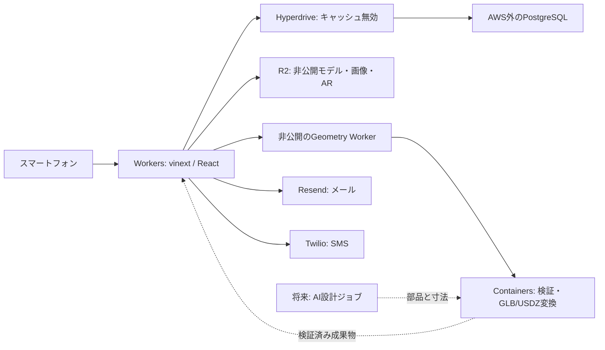

# OshiNest：つくる・確かめる・届ける

2026-09-27。髙尾脩愛・田部健太郎の提案を基準にした構成見直し。

## 目的と今回の到達点

推しがいて、置きたい情景を言葉にできる人が、スマートフォンからぬいのおうちを設計し、実寸確認・公開・注文へ進める。初期対象は10〜20cmのぬい向けのおうち・家具・小物。キャラクター本体の生成を初期機能に含めない。

今回実装するのはCloudflareへ配備するための基盤変更。AI編集画面、モデル生成サービスへの接続、自動修復、実決済は次の実装範囲であり、この変更で完成したとは扱わない。既存の検索・投稿・AR・デモ注文・製造管理を再利用する。

## 構成の判断

| 候補 | 既存との関係 | 判断 |
| --- | --- | --- |
| React SPA + Hono | API・認証・52画面のデータ取得と更新を再構成する | 新規の編集画面には合う。今回は全面移行しない |
| React Router + Vite | React部品は流用できるが、Server Actionsとルートを移植する | 将来のAPI分離後の候補 |
| vinext + Vite | 既存のReact画面・Server ActionsをWorkersで動かす | 今回採用。Next.jsのコンパイラとNode Webサーバーを運用から外す |
| Next.js + OpenNext | Next.jsのビルド成果物をWorkersへ適合させる | 今回はViteへの移行を優先 |

vinextはベータ版。互換性チェッカーだけでは動作保証にならないため、Workers実行環境で認証・更新・ファイル処理を検証する。`next/*`という互換API名と開発時の型・lint用Next.js依存は残す。フレームワークを全面撤去した変更ではない。

選定理由は既存機能の再実装を減らすこと。ビルド時間、初期JS、LCP、CPU時間、月額費用が従来より小さいという実測結果はまだない。「軽い」という評価はこれらを同条件で比較して行う。

## 配備構成

PostgreSQLはCloudflare内にあるDBではない。Neon等、既存のロール・関数・トリガー・RLSを扱えるAWS外の管理先を使う。Hyperdriveは接続を中継するサービスで、データの移行先そのものではない。今回はSQLの業務意味を維持する。

D1へ直接移すと、在庫引当・注文・送金計算・通知・権限をアプリ側へ再実装する必要がある。AI制作機能と同時にこの置換を行うと、データ整合性の検証範囲が大きくなる。D1が必須になった場合は、業務操作ごとの仕様と同時更新テストを抽出して別途移植する。

Hyperdriveでは、利用者識別と`SET LOCAL`を実際のSQLと同じトランザクションに置く。単発SQLもトランザクションで包み、注文等の明示トランザクションはそのまま維持する。利用者依存の結果や注文直後の在庫を共有キャッシュにしない。

R2バケットは非公開。権限確認後に、対象キー・期限・操作・サイズ・Content-Typeに結び付いた署名URLを発行する。公開画像以外の元データに公開URLを作らない。注文済みデータを作品の更新や掃除で消さない。

80MiB入力や256MiBまで展開するBlender処理はContainers側へストリームで渡す。Web Workerではモデル全体を読み込まない。現在は最大2コンテナ、各1処理、30秒で計算スレッドを終了する。混雑時は再実行できるエラーを返す。これは将来の非同期ジョブ処理の完成版ではない。

## 制作機能の中心に置くデータ

最初のAIは、自由形状のメッシュ生成よりも、制約を持つ部品と寸法の提案から始める。屋根・床・壁・扉・棚・接続部のパラメータを編集できれば、AIの出力を利用者が修正しやすく、何を検証したかも記録できる。

| データ | 必要な内容 |
| --- | --- |
| design_projects | 作成者、ぬいの幅・奥行き・高さ、置き場所の上限、作りたい情景、非公開設定 |
| design_revisions | 不変の版ID、部品ライブラリ版、mm単位の寸法・位置・接続、元の版、生成理由 |
| generation_jobs | 利用者、入力版、プロバイダ、処理状態、冪等キー、試行回数、料金上限、エラー |
| fabrication_reports | 入力ハッシュ、方式・材料・プリンタ・スライサーの版、検査項目別の結果、未検査項目 |
| design_artifacts | 版に対応する印刷用3MF/STL、表示用GLB、AR用USDZ、チェックサム |
| works / order_print_files | 公開作品と検証済み版の参照、注文時点のファイル・倍率の固定 |

これは追加予定の設計。まだ業務DBに空のテーブルを大量に追加しない。実装時に利用者・版・注文との外部キーとRLSを同時に追加する。

AIに任意のPython・JavaScript・CADスクリプトをサーバーで実行させない。構造化された部品定義を検証して、許可した形状演算へ変換する。自由形状生成を追加する場合も、生成物は未検証の下書きとして同じ検証経路へ入れる。

## スマートフォンでの操作

1. ぬいの寸法と置き場所を選ぶ。高さだけでなく幅・奥行き・姿勢を確認する。
2. 「白い壁と青い屋根、横に本棚」のように情景を伝える。AIが部品と寸法を提案する。
3. 3Dプレビューで部品を選び、寸法・色・配置を調整する。操作を取り消せる。
4. 寸法・最小肉厚・接続・ベッドへの収まり・造形方向を検証する。修正案は利用者が確認してから適用する。
5. 同じ版のGLB/USDZをARで表示する。利用者が選んだ拡大率を造形寸法へ黙って反映しない。
6. 検証結果・見積り・素材・配送条件を確認し、公開または注文へ進む。

「生成済み」「自動検査済み」「試し刷り確認済み」は区別する。現在の肉厚・自己交差検査は近似であり、実際に印刷できる保証ではない。ARも実寸の保証装置ではなく、機種ごとの校正・配置誤差を測る必要がある。

## AI・製造処理の接続

次の実装ではWorkersが所有権と利用上限を確認してジョブを作り、WorkflowsからAIプロバイダとGeometryサービスを呼ぶ。R2を中間成果物の保存先にする。スマートフォンはジョブIDを保持して、ページを閉じても状態を再取得できるようにする。

状態は `queued → generating → validating → ready / needs_review / failed / cancelled`。版・材料・造形条件を変更すると既存レポートを失効させる。古いジョブが後から完了しても新しい版を上書きしない。再試行には同じ冪等キーを使い、外部APIの応答不明時に新しい課金ジョブを無条件に作らない。

AIプロバイダは今回契約・固定しない。構造化出力の安定性、日本語指示への追従、寸法一致、修正の再現性、1回の費用、利用規約で比較する。GPUによる自由形状生成が必要なら外部生成API等を候補にし、Cloudflare Workersだけで実行できるとは仮定しない。

## 次の小さな検証

最初の題材は「床・壁・屋根を持つ15cmぬい用のおうち」。同じ寸法条件で、手動の部品編集とAIによる部品提案を比較する。

- 寸法と接続条件を機械検証できるか。
- CAD未経験者がスマホで寸法を修正し、元に戻せるか。
- 同じ版から印刷用データとAR用データを作れるか。
- 複数回の生成・修正で寸法や既存部品が意図せず変化しないか。
- 対象プリンタと材料で試し刷りし、ぬいとの適合と測定誤差を記録できるか。

合格寸法公差、生成1回の料金上限、評価人数・回数、対象機種はこの実験を始める前に決める。市場規模・競合不在・世界初という提案書の記述は、この技術変更の検証結果として転記しない。

## 参照

- [Cloudflareのvinext案内](https://developers.cloudflare.com/workers/framework-guides/web-apps/nextjs/)
- [vinextの互換性・既知の制限](https://github.com/cloudflare/vinext)
- [Hyperdriveの接続・トランザクション](https://developers.cloudflare.com/hyperdrive/concepts/how-hyperdrive-works/)
- [R2 Workers API](https://developers.cloudflare.com/r2/api/workers/workers-api-reference/)
- [Cloudflare Containers](https://developers.cloudflare.com/containers/)
