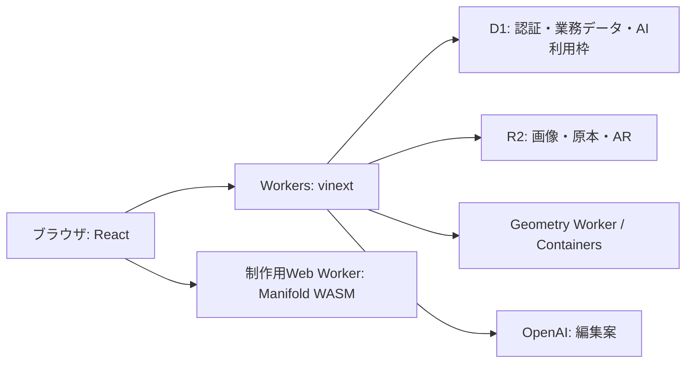

# 設計上の決定

OshiNestは、CAD未経験者がスマートフォンで推しぬいのおうち・家具・小物を設計し、実寸確認・公開・デモ注文へ進むサービス。中心となる対象は10〜20cmのぬい。制作データから公開・注文への自動連携と実決済は未実装。

## 採用した構成

| 採用した方式 | 理由 |
| --- | --- |
| vinext / Viteで既存のReact画面とServer ActionsをWorkers上で動かす | SPA化による画面・認証・更新処理の全面移植を避ける。`next/*`互換APIと型・lint用Next.js依存を残す。ベータ版のため実行環境での検証を維持する |
| D1 / Kyselyを業務DBとする | Cloudflare内で完結させる。PostgreSQLは移行比較用に限定。利用者ごとのSQLビューで読み取りを制限し、トリガーで書込み権限を確認する。複数の更新は一つのbatchで実行する |
| ファイルを非公開R2へ保存する | 権限確認と署名URLで操作を限定。印刷原本、注文時点の原本参照、AR生成物を分ける |
| 投稿ファイルの解析・AR変換をContainersへ分離する | 大きな入力をWeb Worker全体に展開せずストリームで渡す。Geometryは非公開service binding経由 |
| 制作コアをDOM・Reactから独立させる | ブラウザとCLIで同じ設計検証・形状生成・出力を使う。Manifold WASMはブラウザの専用Workerで実行する |
| AIは検証可能な編集案を返す | 変更案の形式と生成メッシュを検査する。編集中に設計が変わっていなければ、取り消し1回で戻せる単位として適用する |
| 自由形状は制限付き構文の専用インタプリタで評価する | 任意のJavaScriptやPythonを実行させない。API・演算量・形状サイズを限定し、失敗時は元の設計を維持する |

React SPA + Hono、React Routerへの全面移行は再実装量が大きいため見送った。Next.js + OpenNextよりViteへの移行を優先した。Rust・MoonBitによる独自形状カーネルは採用せず、既存TypeScriptとManifoldを使う。言語やフレームワーク間の速度・費用は比較していない。

## 運用・製造上の決定

- 新環境に旧環境の会員・注文を移行しない。旧AWSの停止・削除は別作業。
- 一般会員はメール未確認で登録できる。確認済みフラグを偽装しない。メール・SMS・クリエイター申請を停止する。申請再開時の条件は確認済みメール・規約同意・運営承認。
- 注文・送金はデモ。モデル生成・自動検査・試し刷りの確認を区別し、自動検査を製造承認としない。
- 認証情報や利用者データをリクエスト間で共有キャッシュしない。注文のファイル参照を作品編集や掃除で失わない。

## 未実装の構想

現在は設計を端末内またはJSONファイルに保存する。AI処理はHTTP要求とブラウザの再試行で動く。設計と版履歴のクラウド保存、製造レポートや出力ファイルと公開作品・注文の紐付け、Workflowsによるジョブ管理は未実装。

実装する際は、設計の所有者と出力元の版を記録する。再試行による二重実行を冪等キーで防ぎ、料金上限を設ける。古い版から生成した結果で最新の設計を上書きしない。未使用テーブルを先に追加しない。物理試験の前には、プリンタ・材料・寸法公差・対象機種・試行予算を決める。

具体的な仕様は [実装構成](architecture.md)、[制作](house-editor.md)、[AI](design-ai-chat.md)、[D1](d1-migration.md) を参照する。
