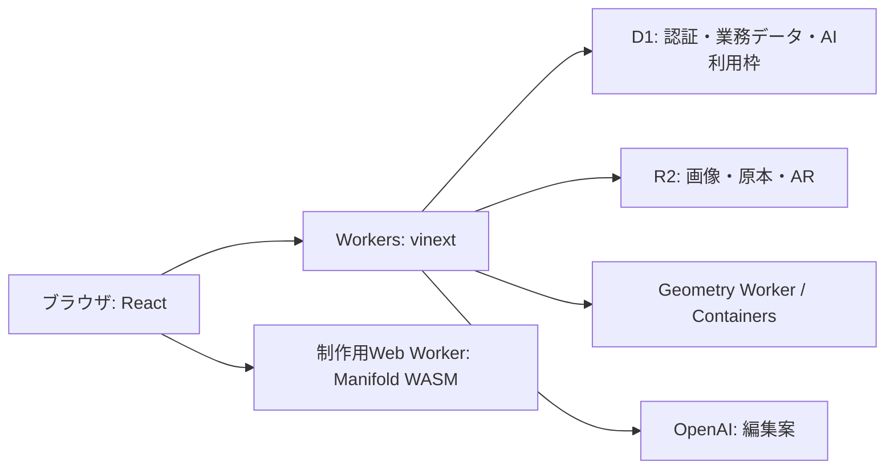

# 設計上の決定

OshiNestは、CAD未経験者がスマートフォンで推しぬいのおうち・家具・小物を設計し、実寸確認・公開・デモ注文へ進むサービス。中心となる対象は10〜20cmのぬい。制作データから公開・注文への自動連携と実決済は未実装。

## 採用した構成

| 決定 | 理由・守る条件 |
| --- | --- |
| vinext / Viteで既存React画面・Server ActionsをWorkers上で動かす | SPA化による画面・認証・更新処理の全面移植を避ける。`next/*`互換APIと型・lint用Next.js依存を残す。ベータ版のため実行環境での検証を維持する |
| D1 / Kyselyを業務DBとする | Cloudflare内で完結させる。PostgreSQLは移行比較用に限定。権限ビュー・トリガー・原子的バッチで可視性と更新の整合性を守る |
| ファイルを非公開R2へ保存する | 権限確認と署名URLで操作を限定。印刷原本、注文時点の原本参照、AR生成物を分ける |
| 投稿ファイルの解析・AR変換をContainersへ分離する | 大きな入力をWeb Worker全体に展開せずストリームで渡す。Geometryは非公開service binding経由 |
| 制作コアをDOM・Reactから独立させる | ブラウザとCLIで同じ設計検証・形状生成・出力を使う。Manifold WASMはブラウザの専用Workerで実行する |
| AIは検証可能な編集案を返す | 元の設計を保持し、構造・実メッシュ・revisionを検査してから履歴の1操作として適用する |
| 自由形状は制限付き構文の専用インタプリタで評価する | 任意のJavaScriptやPythonを実行させない。API・演算量・形状サイズを限定し、失敗時は元の設計を維持する |

React SPA + Hono、React Routerへの全面移行は再実装量が大きいため見送った。Next.js + OpenNextよりViteへの移行を優先した。Rust・MoonBitによる独自形状カーネルは採用せず、既存TypeScriptとManifoldを使う。これらは言語・フレームワーク間の速度や費用の優位性を実証した判断ではない。

## 運用・製造上の決定

- 新環境に旧環境の会員・注文を移行しない。旧AWSの停止・削除は別作業。
- 一般会員はメール未確認で登録できる。確認済みフラグを偽装しない。メール・SMS・クリエイター申請を停止する。申請再開時の条件は確認済みメール・規約同意・運営承認。
- 注文・送金はデモ。モデル生成・自動検査・試し刷りの確認を区別し、自動検査を製造承認としない。
- 認証情報や利用者データをリクエスト間で共有キャッシュしない。注文のファイル参照を作品編集や掃除で失わない。

## 未実装の構想

クラウド上の設計プロジェクト・不変revision・生成ジョブ・製造レポート・成果物と、公開作品・注文の連携は将来設計。現状の保存は端末とJSONであり、AI処理はHTTP要求とブラウザの修正ループで動く。Workflowsによる永続ジョブは未実装。

導入する場合は所有権、版と成果物の対応、冪等キー、料金上限、古いジョブの適用拒否を一緒に設計する。未使用テーブルを先に追加しない。物理試験の前には、プリンタ・材料・寸法公差・対象機種・試行予算を決める。

具体的な仕様は [実装構成](architecture.md)、[制作](house-editor.md)、[AI](design-ai-chat.md)、[D1](d1-migration.md) を参照する。
